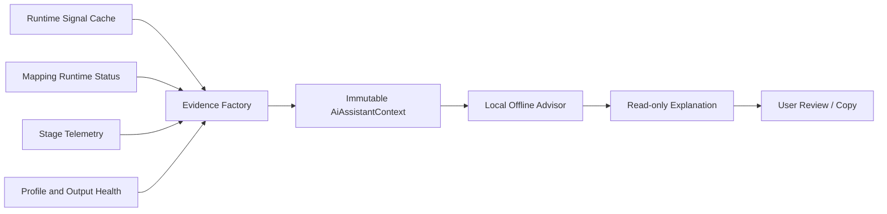

# AI Assistant

## Scope

Chapter 24 introduces a read-only AI Assistant foundation. The initial provider is `LocalAiAssistantService`, a deterministic offline advisor that explains facts already exposed by profile configuration, the Runtime Signal Cache, mapping runtime status, stage telemetry, Profile Health, and Output Manager diagnostics.

It does not call a cloud service, create mappings, change transforms, install drivers, reset outputs, or write profiles. The service interface contains one operation: `Explain(AiAssistantContext)`.

## Requirement Classification

| Requirement | Status | Notes |
| --- | --- | --- |
| Explain selected devices | Complete foundation | Device Inspector supplies current identity, control, cached signal, mapping, rate, latency, and stage evidence. |
| Explain selected mappings | Complete foundation | Mapping Editor supplies input/output configuration, runtime status, current signal, and transform diagnostics. |
| Explain signal flow | Complete | Signal Flow Inspector supplies the selected source and its measured stages. |
| Explain profile health | Complete | Existing validation issues and profile counts are summarized without changing the profile. |
| Explain output plugins | Complete | Output Monitor supplies health, rates, queues, scheduler latency, current Xbox/keyboard state, and errors. |
| Copy explanation | Complete | The reusable dialog copies an evidence timestamped plain-text report. |
| User approval before changes | Complete boundary | Suggestions are marked `RequiresConfirmation`; no assistant mutation API exists. |
| Completely offline operation | Complete | The initial provider performs no network or file I/O. |
| Natural-language profile generation | Deferred | Requires a reviewed proposal and explicit apply workflow. |
| Cloud/model providers | Deferred | Requires explicit consent, redaction, provider policy, and secure credential storage. |
| Learning, voice, and AI node graphs | Deferred | No observation, training, voice, or autonomous graph generation is implemented. |

## Evidence Model

`AiAssistantContext` is immutable and contains:

- subject kind, ID, name, purpose, and capture time;
- current configuration facts;
- current runtime facts;
- measured processing stages;
- warnings and errors already reported by owning subsystems.

The assistant receives snapshots, never hardware handles, plugin implementations, mutable profile collections, or private runtime state. A missing live sample is represented explicitly as `Waiting for input`; the provider does not invent a value.

## Explanation Contract

Every explanation includes:

- what the selected object does;
- why current diagnostics describe that behavior;
- current runtime state;
- active measured or configured transforms;
- evidence-based suggestions, if any;
- provider and evidence timestamp.

Suggestions are generated only from supplied warnings, errors, a missing live sample, or explicit subsystem health failure. A healthy selection produces no invented optimization advice.

## UI Entry Points

`AI Explain` is available from:

- Device Inspector;
- Mapping Editor;
- Signal Flow Inspector;
- Profile Health Report;
- each Output Monitor plugin card.

The `ai-assistant` Beta feature flag controls composition of these entry points. Disabling it and restarting leaves all profile and runtime behavior unchanged.

## Deferred Capabilities

Future providers may support richer language generation or proposal creation, but they must retain the same immutable evidence boundary. A separate proposal/review/apply contract is required before any assistant-generated change can enter a profile. Direct hardware, Mapping Engine, Output Manager, filesystem, or network access is not part of `IAiAssistantService`.