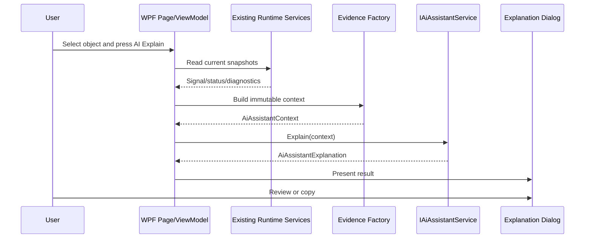
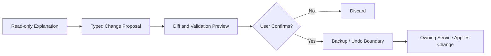

# AI Integration

## Boundaries

The AI Assistant is a Core service with no WPF, input-provider, output-plugin, persistence, or network dependency.

| Component | Responsibility |
| --- | --- |
| `AiAssistantEvidenceFactory` | Converts current domain snapshots into immutable, bounded evidence. |
| `IAiAssistantService` | Produces a read-only explanation. |
| `LocalAiAssistantService` | Implements deterministic offline explanation and approval-required suggestions. |
| Page view models | Select the current object and request an explanation. |
| `AiExplanationWindow` | Presents and copies the result; it does not analyze or mutate runtime data. |

## Data Flow

No call in this flow performs mapping, output, profile save, driver management, or runtime reset.

## Grounding Rules

Providers must:

- use only facts present in `AiAssistantContext`;
- state when a live signal or measured stage is unavailable;
- preserve warning/error wording from owning diagnostics;
- distinguish configured transforms from measured execution stages;
- avoid claiming hardware behavior that is not represented by current evidence;
- attach suggestions only to an observed issue or missing evidence.

## Approval Flow

The Chapter 24 service cannot apply changes. Each `AiAssistantSuggestion` is marked `RequiresConfirmation` and contains a proposed follow-up for user review.

A future apply workflow must be a separate service and transaction:

The assistant must never receive direct profile mutation or output-dispatch capabilities.

## Provider Extension

Future providers implement `IAiAssistantService` and are composed behind feature policy. Remote providers additionally require the privacy controls in `AI_PRIVACY.md`. Provider failures must be isolated at the UI boundary and logged through `IStructuredLog`; input, mapping, and output continue normally.

## Testing

Automated tests cover:

- offline provider policy and absence of mutation operations;
- exact transfer of configuration, runtime, stage, profile, and output evidence;
- missing-sample behavior;
- approval-required suggestions;
- healthy contexts producing no invented recommendations;
- copyable plain-text output;
- Beta feature policy.

WPF compilation and startup smoke validate the dialog and page bindings separately from Core source-line coverage.