# Architecture

This document is the Chapter 2-24 architecture baseline for HOTASBridge Version 2. It defines system boundaries, the RuntimeSignal engine, typed runtime events, signal-native Windows input, cache/telemetry-backed diagnostics, versioned extensions, the optional scripting foundation, deployment boundaries, executable architecture governance, and the read-only AI advisor boundary.

## Chapter 2 Requirement Comparison

| Requirement | Status | Notes |
| --- | --- | --- |
| Every subsystem has one responsibility | Complete foundation | Core coordinators own profile persistence/management, device discovery, input monitoring, runtime mapping, and runtime sessions. Focused view models own page and presentation state. `MainViewModel` retains explicit lifecycle, Dispatcher sampling, composition, and cross-page reactions; focused views now own all primary page presentation. |
| Dependencies clearly defined | Complete foundation | Core interfaces define input, profile, mapping, telemetry, logging, and output boundaries. |
| Runtime flow documented | Complete | See Runtime Flow. |
| Thread ownership defined | Complete | See Thread Ownership. |
| Communication rules established | Complete | Services communicate through interfaces; one typed `IRuntimeEventBus` publishes signal, profile-persistence, stage-diagnostic, plugin-lifecycle, and output-plugin messages with ordered, isolated delivery. |
| Startup and shutdown deterministic | Complete foundation | `App.xaml.cs` owns lifecycle order and `ApplicationComposition.cs` registers the application graph through Microsoft DI. |
| Future expansion paths preserved | Complete foundation | RuntimeSignal, telemetry, and stage diagnostics are now UI-independent foundations. |
| Agent Note 002 telemetry framework | Complete foundation | `IRuntimeTelemetry` and `InMemoryRuntimeTelemetry` expose metrics, rates, durations, counters, statuses, and snapshots. |
| Agent Note 003 stage diagnostics | Complete foundation | Runtime stages publish input/output value, enabled state, duration, timestamp, warnings, errors, and description. |
| Agent Note 004 RuntimeSignal model | Complete foundation | `RuntimeSignal` normalizes current input, previous input, timestamp, source, metadata, diagnostics, optional history, and flags. |

## Chapter 3 Requirement Comparison

| Requirement | Status | Notes |
| --- | --- | --- |
| Every input becomes a RuntimeSignal | Complete | Input callbacks publish through `IRuntimeSignalEngine` before UI, learning, diagnostics, and mapping consumption. |
| Processing stages communicate through RuntimeSignal | Complete | Ordered `IRuntimeSignalStage` implementations receive and return only RuntimeSignal objects. |
| Immutable publication | Complete | Metadata and history are frozen before cache/event publication. |
| Required signal types and quality | Complete | All minimum extensible types and quality flags are defined. |
| Runtime state separated from configuration | Complete | Runtime state moved to `RuntimeMappingStateStore`. |
| Standardized extensible pipeline | Complete | Stage insertion requires composition only. |
| Runtime Signal Cache | Complete | Read-only consumer API; mutation is internal to `RuntimeSignalEngine`. |
| Event publication | Complete | The signal engine mirrors immutable cache publications onto the shared typed bus; profile, diagnostics, plugin, and output publishers use the same contract. |
| Signal-native output boundary | Complete | Output Mapping emits immutable `OutputAction` records; Output Manager plugins consume them, while `XboxState` remains backend/diagnostic state only. |

Detailed lifecycle, pipeline, and producer/consumer diagrams are in `docs/RUNTIME_SIGNAL_MODEL.md`; typed publication rules and current message contracts are in `docs/EVENT_BUS.md`.

## Chapter 4 Requirement Comparison

| Requirement | Status | Notes |
| --- | --- | --- |
| Common input provider interface | Complete | `IInputProvider` is the app-facing discovery, lifecycle, signal, error, and resource boundary. |
| Existing HOTAS implementation preserved | Complete | HID native discovery/readers are wrapped rather than rewritten. |
| RuntimeSignal publication | Complete | Provider adapters convert compatibility events inside the Input layer. |
| Automatic device lifecycle | Complete | Native Windows HID topology notifications wake serialized discovery after a short debounce; a 30-second safety poll and automatic two-second degraded fallback preserve recovery. |
| Device health and errors | Complete foundation | Provider status plus Connected/Active/Idle/Error/Disconnected health and telemetry. |
| Stable device identity | Complete | Windows HID discovery reads SetupAPI Container IDs, profiles persist/backfill them additively, and matching retains GUID, serial, path, VID/PID, usage, and name fallbacks without changing Stable IDs. |
| Multiple devices and controls | Complete | Existing profile groups and unlimited discovered controls preserved. |
| Input Learn Mode | Complete | Scoped baseline detection, noise rejection, highlighting, details, Confirm, Retry, and capture-only mode. |
| DirectInput | Deferred | No current backend/dependency; provider contract supports later insertion. |

See `docs/INPUT_LAYER.md`, `docs/DEVICE_MODEL.md`, and `docs/DEVICE_DISCOVERY.md`.

## Chapter 5 Requirement Comparison

| Requirement | Status | Notes |
| --- | --- | --- |
| Per-device live inspector | Complete | Existing tabs preserved and extended with summary, quality, performance, and history. |
| Cache-only runtime reads | Complete | UI resolves current values through `IRuntimeSignalCache`. |
| Unknown controls remain visible | Complete foundation | Unknown model/display/export path added; providers may publish the type. |
| Freeze/reset/export tools | Complete | Freeze is UI-only; JSON, CSV, and text exporters are Core services. |
| Mapping preview | Complete | Selected control resolves current profile mapping and transform summary. |
| Signal Flow Inspector | Complete foundation | Live/freeze telemetry view with source-filtered stages and output/OS boundaries. |
| Recording/playback/history foundation | Complete | Versioned RuntimeSignal recording, playback, cache history, and OutputAction regression comparison are active. |
| Interactive single-step replay UI | Deferred | The playback service exists; a frame-by-frame Signal Flow control remains future diagnostics work. |

See `docs/DEVICE_INSPECTOR.md` and `docs/DIAGNOSTICS.md`.

## Chapter 8 Requirement Comparison

| Requirement | Status | Notes |
| --- | --- | --- |
| Modular transform units | Complete | Registered `IRuntimeTransform` implementations consume and return RuntimeSignal values. |
| Ordered per-mapping chains | Complete | Schema-v8 descriptors execute in stored order and own mapping behavior; descriptor-free mappings retain a compatibility fallback. |
| Standard transform library | Complete | Calibration through direction detection are registered; double press is deferred. |
| Configurable analog filters | Complete | Moving Average, Exponential Smoothing, and Median Filter use centralized typed configuration, mapping/profile validation, isolated runtime state, and focused Transform Editor controls. |
| Per-control calibration | Complete foundation | Validated minimum/center/maximum/offset is matched by stable device/control identity. |
| Live editing | Complete | Transform Editor resets and rebuilds only the affected mapping's transform state. |
| Diagnostics | Complete | Every descriptor publishes shared stage metadata to telemetry. |
| Transform presets | Complete | Separate device-independent JSON storage with CRUD/import/export. |
| Keyboard/PWM injection | Complete | Mapping-owned analog PWM, Windows SendInput, capture, bipolar timing, cleanup, and diagnostics operate through Output Manager. |

See `docs/TRANSFORM_ENGINE.md` and `docs/TRANSFORMS.md`.
## Chapter 9 Requirement Comparison

| Requirement | Status | Notes |
| --- | --- | --- |
| Output plugin lifecycle | Complete foundation | `IOutputPlugin` covers initialize/start/process/reset/stop/diagnostics/dispose. |
| Existing Xbox output | Complete | ViGEm Xbox 360 remains the compatibility-first default behind `XboxOutputPlugin`. |
| Optional Xbox-family output | Beta | Feature-gated HIDMaestro uses a separately identified plugin and explicit driver setup while existing Xbox mappings remain unchanged. |
| Keyboard output | Complete | Windows SendInput supports captured VK/scan codes, combinations, hold/toggle/pulse/repeat, bipolar PWM, and clean reset. |
| Central scheduler | Complete | One timer loop owns all current timed output jobs. |
| Plugin failure isolation | Complete | Manager diagnoses/resets failed plugins and continues dispatching others. |
| Runtime output state separation | Complete | Plugin/scheduler state is never persisted to profiles. |
| Output Monitor | Complete | UI consumes only manager diagnostic snapshots, including cumulative ViGEm backend failure evidence. |
| Internal plugin SDK/discovery | Complete foundation | Shared manifests, catalog, compatibility checks, lifecycle, and bounded metadata discovery are active; external assembly loading remains separately gated. |

See `docs/OUTPUT_SYSTEM.md` and `docs/OUTPUT_PLUGINS.md`.
## Chapter 13 Requirement Comparison

| Requirement | Status | Notes |
| --- | --- | --- |
| Error classification and health model | Complete | UI-independent severity and subsystem health contracts are shared by diagnostics, telemetry, and watchdog. |
| Device and power recovery | Complete foundation | Hot-plug events neutralize stale output; suspend/resume performs coordinated stop, refresh, and optional restart. |
| Output failure isolation and restart | Complete | Failed plugin timers are cancelled and only that plugin is stopped, reset, and restarted. |
| Emergency reset | Complete | Shared command is exposed from all four required UI locations. |
| Safe Mode and session recovery | Complete | Atomic unclean marker, startup restore choice, and `--safe-mode` output isolation. |
| Crash reports | Complete | Atomic local JSON reports contain classified, privacy-limited runtime context. |
| Runtime Watchdog | Complete | Read-only probes publish health and invoke owning-subsystem recovery callbacks with cooldown. |

See `docs/RELIABILITY.md`, `docs/RECOVERY.md`, and `docs/CRASH_REPORTS.md`.

## Chapter 15 Requirement Comparison

| Requirement | Status | Notes |
| --- | --- | --- |
| Shared plugin identity and manifest | Complete foundation | Internal and future external plugins use manifest schema v1 and SDK API v1.0. |
| Internal Xbox/Keyboard plugins | Complete | Existing adapters publish manifests and retain their tested lifecycle/native implementations. |
| Discovery and compatibility | Complete foundation | Startup reads bounded local manifests, negotiates API/dependencies, and disables invalid candidates without loading assemblies. |
| Plugin isolation | Complete foundation | Catalog validation is independent; Output Manager still isolates runtime failures per plugin. |
| Versioning strategy | Complete | Inclusive minimum/exclusive maximum API ranges plus semantic plugin/dependency versions. |
| Plugin Manager online readiness | Complete architecture | Catalog/search/repository/package/signature seams exist with offline/read-only defaults. |
| External assembly loading | Deferred | Requires a separate loader/security milestone. |
| Online repository | Deferred | No network service is implemented in Version 2. |

See `docs/PLUGIN_SDK.md`, `docs/PLUGIN_API.md`, `docs/PLUGIN_LIFECYCLE.md`, and `docs/PLUGIN_MANAGER.md`.

## Chapter 19 Requirement Comparison

| Requirement | Status | Notes |
| --- | --- | --- |
| Optional deterministic Macro Engine | Complete foundation | Profiles without macros retain the existing mapping path. |
| RuntimeSignal triggers and OutputActions | Complete | Macros consume immutable signals/system events and emit standardized actions or host commands. |
| Central scheduler and no per-macro threads | Complete | Timers, delay, wait, and repeats use `IOutputScheduler`. |
| Conditions, repeats, variables, runtime state | Complete foundation | Required Boolean/Integer/Float session state and safeguards are active. |
| Safe cancellation and output cleanup | Complete | Stop/failure/profile/reset/shutdown paths release tracked outputs. |
| Macro Debugger | Complete initial surface | Shared snapshots provide state, actions, variables, timing, scheduler, and errors. |
| Visual authoring and local integrations | Complete | Easy and Advanced editors provide recording, ordered keyboard/mouse/Xbox actions, delays, toggle/hold behavior, learned triggers, sequence/ping-pong playback, import, and export. |
| Voice, network, and SimConnect integrations | Deferred outside current local scope | The Macro Engine remains usable without these optional providers. |

See `docs/MACRO_ENGINE.md`, `docs/MACROS.md`, and `docs/RUNTIME_VARIABLES.md`.

## Chapter 20 Requirement Comparison

| Requirement | Status | Notes |
| --- | --- | --- |
| Optional Lua scripting | Complete foundation | The Experimental engine is off by default and disabled in Safe Mode. |
| Stable public Script API | Complete | `HOTASBridge.ScriptApi` has independent versioning and no internal assembly references. |
| RuntimeSignal and event integration | Complete foundation | Immutable signal, profile, device, mapping, macro, and timer events cross the boundary. |
| Output and host integration | Complete foundation | Requests use OutputActions, the central scheduler, and application-owned adapters. |
| Signed packages and publisher trust | Complete trusted-package foundation | Deterministic `.hotasscript` archives verify exact manifest/source bytes with ECDSA P-256 and a local public-key allow-list. |
| Explicit permissions | Complete | Package permissions are mandatory and every Lua host operation enforces its capability. Legacy local scripts retain a diagnosed compatibility default. |
| Resource controls | Complete trusted in-process foundation | Source, strings, event queues, host commands, instruction work, and per-invocation managed allocation are bounded and diagnostic. |
| Sandboxed execution | Complete constrained foundation | OS, file, debug, dynamic-load, network, native, and automatic .NET interop are unavailable. Untrusted packages fail closed. |
| Script Workbench | Complete Experimental surface | Local-only source editing, Lua validation, atomic save, reload, and live trust/quota/error diagnostics are available in Advanced mode. |
| Out-of-process untrusted execution | Deferred and blocked | The policy and isolation metadata extension point exist; no untrusted package is accepted until a separate process host is implemented. |
| Breakpoints, step debugger, persistent variables, and alternate languages | Deferred | These remain future milestones and do not affect stable mapping behavior. |

See `docs/SCRIPTING.md`, `docs/SCRIPT_API.md`, `docs/SCRIPT_SECURITY.md`, and `docs/SCRIPT_PACKAGES.md`.

## Chapter 21 Requirement Comparison

| Requirement | Status | Notes |
| --- | --- | --- |
| Local searchable Profile Library | Complete | Search covers name, game, aircraft, vehicle, hardware, tags, author, and category. |
| Rich optional profile metadata | Complete | Schema v6 adds category, difficulty, game, aircraft, vehicle, and hardware without changing runtime behavior. |
| Import/export provider architecture | Complete foundation | `IProfileImporter`, `IProfileExporter`, and `IProfileLibraryService` isolate formats from WPF and persistence. |
| Compatibility preview | Complete | Schema, plugins, devices, transforms, conversion warnings, and validation are reported before mutation. |
| Templates and selected-content export | Complete | Device-neutral templates, selected mappings, and device groups use versioned package envelopes. |
| Profile Comparison Tool | Complete | Deterministic side-by-side diff, selected merge, and JSON/HTML reports share the profile model. |
| Vendor importers and community services | Deferred | Provider extension points exist; no online or third-party conversion service is implemented. |

See `docs/PROFILE_LIBRARY.md`, `docs/IMPORT_EXPORT.md`, and `docs/PROFILE_METADATA.md`.

## Chapter 24 AI Assistant Boundary

| Requirement | Status | Notes |
| --- | --- | --- |
| Advisor remains read-only | Complete | `IAiAssistantService` exposes explanation only; no profile, mapping, device, or output mutation API is present. |
| Live/configuration grounding | Complete | Immutable contexts are built from cache, telemetry, mapping status, profile validation, and output diagnostics. |
| Five AI Explain entry points | Complete | Device Inspector, Mapping Editor, Signal Flow, Profile Health, and Output Monitor use one service and dialog. |
| User approval | Complete boundary | Every suggestion requires confirmation; no apply workflow is implemented. |
| Offline mode | Complete | The initial provider has no network or persistence dependency. |
| Remote models, learning, generation | Deferred | Privacy consent, redaction, proposal review, and secure provider architecture are required first. |

See `docs/AI_ASSISTANT.md`, `docs/AI_PRIVACY.md`, and `docs/AI_INTEGRATION.md`.

## Chapter 25 Long-Term Governance Boundary

Chapter 25 preserves the existing runtime architecture and governs how it may evolve. The Runtime Signal Engine, Mapping Engine, Transform Engine, Output Manager and plugins, Profile System, centralized scheduler, and diagnostics framework are stable foundations. Capabilities enter through compatible adapters and published contracts unless measured evidence and a superseding ADR justify replacement.

Formal review gates are repository-owned data under `docs/architecture-reviews`. The validator checks review records and ADR evidence, protects profile versions beyond the currently reviewed schema v9, and exposes Version 1.0 review status to release validation. Governance tools do not enter the runtime processing path and do not modify user configuration.

| Requirement | Status | Evidence |
| --- | --- | --- |
| Universal HID signal-processing vision | Implemented | `LONG_TERM_VISION.md` defines mission, domains, extension tests, and stable foundations. |
| Modular, compatibility-first governance | Implemented | `PROJECT_GOVERNANCE.md` defines sources of truth, decision classes, ownership, debt, documentation, and amendment. |
| Formal milestone architecture reviews | Implemented | Policy, template, baseline record, schedule, validator, and negative self-test. |
| ADR findings and specification updates | Implemented | ADR 0001 and ADR 0002 plus Chapter 25 architecture, roadmap, health, and release updates. |
| Version 1.0 architecture acceptance | Planned gate | The schedule and Project Health deliberately keep this review unsatisfied until release evidence is complete. |

## Runtime Flow

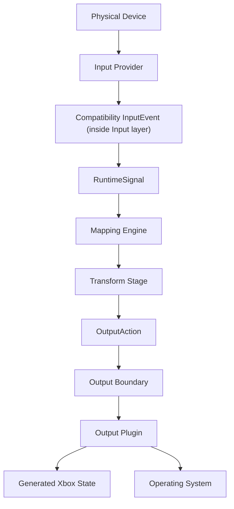

Current implementation note: `RuntimeSignal` is the normalized mapping input and `OutputAction` is the only Mapping Engine output contract. `XboxState` remains generated state inside the Xbox/ViGEm backend and diagnostics views; it is not a mapping boundary.

## Thread Ownership

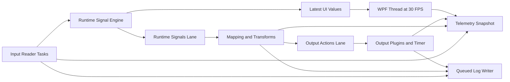

Thread rules:

- UI thread: rendering, commands, observable collections, and sampled view-model updates only.
- Input reader tasks: HID/simulation acquisition and RuntimeSignal publication only.
- Runtime Signals lane: `RuntimeMappingCoordinator` owns held state, active-layer snapshots, mapping lookup dispatch, and OutputAction queueing.
- Output Actions lane: ordered Output Manager and plugin dispatch.
- Output timer: centralized PWM, pulse, repeat, and delayed callbacks only.
- Logging writer: bounded, batched asynchronous JSON-lines output with explicit flush, configurable owned-file retention, and shared telemetry.
- Telemetry: UI-independent snapshots; consumers cannot mutate runtime state.

See `docs/THREADING.md` for ownership, synchronization, UI coalescing, and shutdown rules.
## Subsystem Dependency Diagram

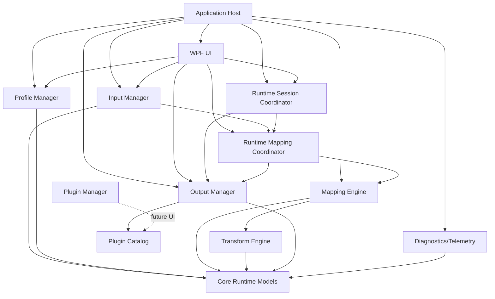

Dependency rules:

- Core owns domain models, `RuntimeSignal`, telemetry contracts, diagnostics contracts, and mapping abstractions.
- Input projects may create `InputEvent` objects but do not map or write outputs.
- Windows HID discovery and live readers share one Input-owned native value-cap layout and logical-value parser; no HID parsing contract leaks into Core or WPF.
- Mapping consumes normalized runtime data and does not call Windows APIs.
- Output owns driver-specific calls and never reads hardware.
- Diagnostics/telemetry is read-only from the perspective of runtime behavior.

## Service Registration Overview

`ApplicationComposition.cs` is the approved Microsoft DI registration root. `App.xaml.cs` retains only WPF lifecycle, recovery, startup-order, watchdog, and coordinated-shutdown orchestration. Existing runtime services remain explicit singletons so their established shutdown sequence is preserved.

| Service Role | Current Implementation | Lifetime |
| --- | --- | --- |
| Paths/config root | `AppPaths` | Singleton |
| Structured log | Asynchronous `JsonFileLog` through `IFlushableStructuredLog` | Singleton |
| Telemetry | `InMemoryRuntimeTelemetry` | Singleton |
| Input provider manager | `CompositeInputProvider` through `IInputProvider` | Singleton |
| Device coordinator | `DeviceCoordinator` through `IDeviceCoordinator` | Singleton |
| Input monitoring coordinator | `InputMonitoringCoordinator` through `IInputMonitoringCoordinator` | Singleton |
| Runtime mapping coordinator | `RuntimeMappingCoordinator` through `IRuntimeMappingCoordinator` | Singleton |
| Runtime session coordinator | `RuntimeSessionCoordinator` through `IRuntimeSessionCoordinator` | Singleton |
| Provider adapters | Windows HID, Raw Input, and simulation `InputProviderAdapter` instances | Singleton |
| Profile manager/store | `JsonProfileStore`, `ProfilePersistenceCoordinator`, and Core `ProfileManagementCoordinator` through published interfaces | Singleton |
| Running application catalog | `SystemRunningApplicationCatalog` through `IRunningApplicationCatalog` | Singleton |
| Application settings | `JsonApplicationSettingsStore` | Singleton |
| Mapping engine | MappingEngine through IMappingEngine | Singleton |
| Macro engine | `MacroEngine` through `IMacroEngine` | Singleton |
| Runtime variable store | `RuntimeVariableStore` through `IRuntimeVariableStore` | Singleton within macro engine |
| Transform engine | RuntimeTransformEngine through ITransformEngine | Singleton within mapping engine |
| Transform preset store | JsonTransformPresetStore | Singleton |
| Output manager | `OutputManager` through `IOutputManager` | Singleton |
| Runtime work scheduler | `RuntimeWorkScheduler` through `IRuntimeWorkScheduler` | Singleton |
| Output scheduler | `OutputScheduler` through `IOutputScheduler` | Singleton |
| Output plugins | Xbox 360 and feature-gated Xbox One `XboxOutputPlugin` instances, plus `KeyboardOutputPlugin` and `MouseOutputPlugin`, through `IOutputPlugin` | Singleton |
| Virtual gamepad drivers | `ViGEmBusDriverService` and feature-gated `HidMaestroDriverService` through `IVirtualGamepadDriverService` | Singleton |
| Deployment assessment | `DeploymentAssessmentService` through `IDeploymentAssessmentService` | Singleton |
| Deployment backup | `DeploymentBackupService` through `IDeploymentBackupService` | Singleton |
| Update service | `OfflineUpdateService` through `IUpdateService` | Singleton |
| Xbox native backends | `VirtualXboxOutputService` (Xbox 360) and feature-gated `HidMaestroXboxOutputService` (Xbox One) through `IVirtualGamepadOutput` | Singleton |
| Plugin catalog | `PluginCatalog` through `IPluginCatalog` | Singleton |
| Plugin discovery | `JsonPluginManifestDiscovery` through `IPluginDiscoverySource` | Startup operation |
| Developer dashboard | Debug-only view model consuming `IRuntimeTelemetry` | Debug-only |

Target DI rules:

- Singleton: managers, configuration, logging, telemetry, mapping engine, output manager, plugin manager.
- Scoped: future scripting contexts and plugin execution contexts.
- Transient: validators, converters, small factories, import/export helpers.

## Startup Sequence

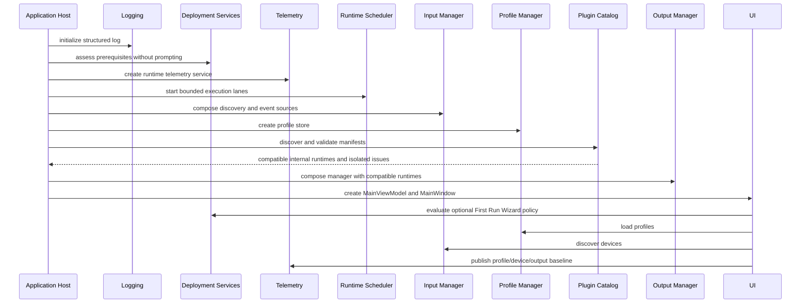

## Shutdown Sequence

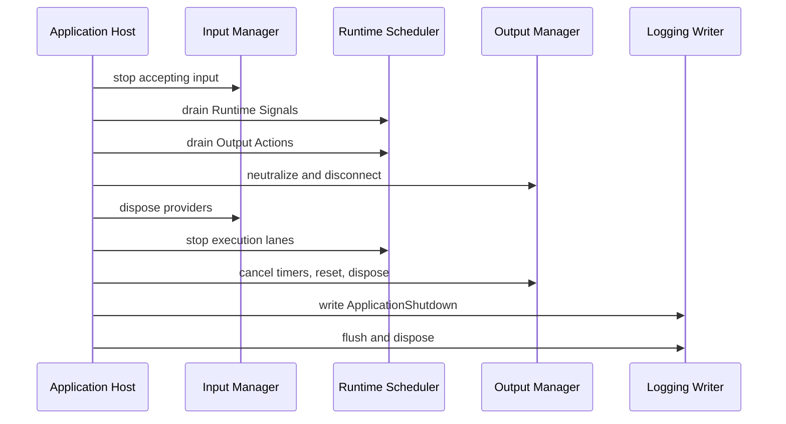

Shutdown invariant: no held virtual buttons or keys, active input readers, accepted queued runtime work, active timer jobs, controller connection, or unflushed accepted log event remains after completion.
## RuntimeSignal Model

`RuntimeSignal` is the immutable runtime processing object. It carries:

- raw, normalized, current, and previous values;
- signal kind, current state, and quality;
- timestamp;
- source device and control;
- metadata;
- diagnostics;
- optional history samples;
- processing flags.

Existing `InputEvent` objects now adapt into `RuntimeSignal` before mapping. Existing mappings and profiles are preserved.

Chapter 3 makes that adaptation an engine-owned one-time publication before UI, learning, diagnostics, and mapping.

| Runtime Service | Responsibility |
| --- | --- |
| `IRuntimeSignalEngine` | Normalize, validate, freeze, cache, diagnose, and publish signals. |
| `IRuntimeEventBus` | Deliver typed application messages in subscription order with per-subscriber fault isolation. |
| `IRuntimeSignalCache` | Read-only latest signal per active control. |
| `IRuntimeSignalPipeline` | Execute ordered insertable signal stages deterministically. |
| `IRuntimeMappingStateStore` | Expose runtime-only mapping state independently of profile configuration. |

## Telemetry And Stage Diagnostics

`IRuntimeTelemetry` is UI-independent and supports:

- gauges;
- counters;
- rates;
- duration averages and worst cases;
- status values;
- stage diagnostics;
- immutable snapshots for readers.
`RuntimeTelemetrySession` is the versioned, UI-independent history model. `RuntimeTelemetrySessionAnalysis` projects numeric metrics and stage durations into samples and compares session averages. `IRuntimeTelemetrySessionStore` keeps persistence replaceable; `JsonRuntimeTelemetrySessionStore` provides atomic local JSON storage while exposing only opaque storage IDs to consumers. The Debug Performance Profiler is an adapter over these contracts rather than the owner of telemetry history.

Current producers:

- Input Manager: provider statuses, connected/active/idle devices, controls, events/sec, queue depth, and signal totals.
- Mapping Engine: mappings evaluated, active mappings, matched mappings, average/worst mapping duration.
- Transform Engine: axis transform latency and active transforms.
- Output Manager: per-plugin health/rates/queues/errors, Xbox updates, keyboard keys/sec, centralized scheduler queue/latency, and driver status.
- UI: FPS and dispatcher queue-length status.
- Memory/Process: working set, managed heap, GC collections, large object heap, CPU usage, thread count.

`RuntimeStageDiagnostic` exposes current input value, current output value, enabled state, last execution timestamp, processing duration, warning/error state, description, source device/control identity, pipeline identity, and stage order. The Signal Flow Inspector reads these snapshots directly.

## Deferred Chapter 2 Work

- External plugin assembly loading, package management, signature enforcement, and sandboxing.
- DirectInput, vJoy, MIDI, and OSC plugin implementations. Network and online services are outside the current product scope.

## Profile Configuration Boundary

Schema v6 separates persisted configuration from runtime state:

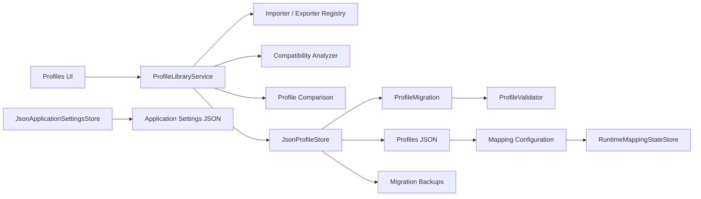

Profiles own metadata, logical device groups, identity matching evidence, mappings, transform descriptors, curves, layers, and output configuration. `RuntimeMappingStateStore` continues to own current values, toggles, timers, and execution state. Output state is never serialized.

`ProfileLibraryService` performs search, provider selection, preview, compatibility analysis, and package export. `JsonProfileStore` performs supported migration, exact pre-migration or pre-replacement backup, validation, and atomic persistence. The Profile Health Report and Profile Comparison services consume configuration independently from WPF and do not mutate it until a user confirms a merge or import.

## Chapter 6 Requirement Status

| Requirement | Status |
| --- | --- |
| Versioned human-readable profiles and v1 migration | Complete |
| Logical device groups and reconnect matching | Complete |
| Mapping/transform/output configuration | Complete with legacy runtime compatibility fields preserved |
| Import/export/duplicate/rename/Save As | Complete with compatibility preview and package providers |
| Manual and configurable Auto Save | Complete with nested content dirty tracking and unchanged-interval suppression |
| Migration backups, recents, and separate storage | Complete |
| Profile Health Report and issue navigation | Complete |
| Templates and selected-content packages | Complete |
| Favorites, vendor converters, and online community sharing | Deferred |

## Mapping And Output Action Boundary

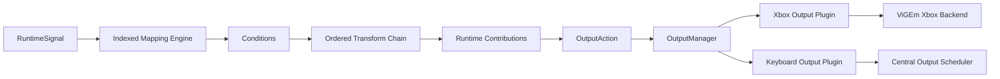

`RuntimeMappingCoordinator` owns the runtime context snapshot, held-control set, active-layer selection, Runtime Signals queue submission, and Output Actions queue submission. `MappingEngine` owns lookup, condition evaluation, transform execution, runtime mapping state, contributions, and conflict resolution. It emits immutable `OutputAction` records and has no hardware/Windows dependency. `OutputManager` owns backend routing and the generated Xbox compatibility state. The WPF view model retains UI sampling and defines macro/script lifecycle hooks. `RuntimeSessionCoordinator` owns the mapping/output session cancellation lifetime, start/stop serialization, output connection, queue drain, neutralization, reset, and disconnect sequence; the view model no longer owns those runtime resources.

Mapping snapshots are replaced atomically for live edits. Disabling/removing/retargeting a contributing mapping returns transition actions, which the app submits without restarting input or output.

## Chapter 7 Requirement Status

| Requirement | Status |
| --- | --- |
| RuntimeSignal to OutputAction | Complete |
| Indexed lookup and deterministic priority | Complete |
| Conditions and held shift layers | Complete foundation |
| Ordered transform descriptors | Complete for known axis transforms |
| Runtime-only mapping state/contributions | Complete |
| Live editing with output transitions | Complete |
| Output Manager and Xbox backend routing | Complete foundation |
| Mapping Explorer | Complete |
| Keyboard/PWM output backend | Complete through Output Manager plugins and central scheduler |
| Blend conflict mode | Deferred |

## WPF UI And Workspace Boundary

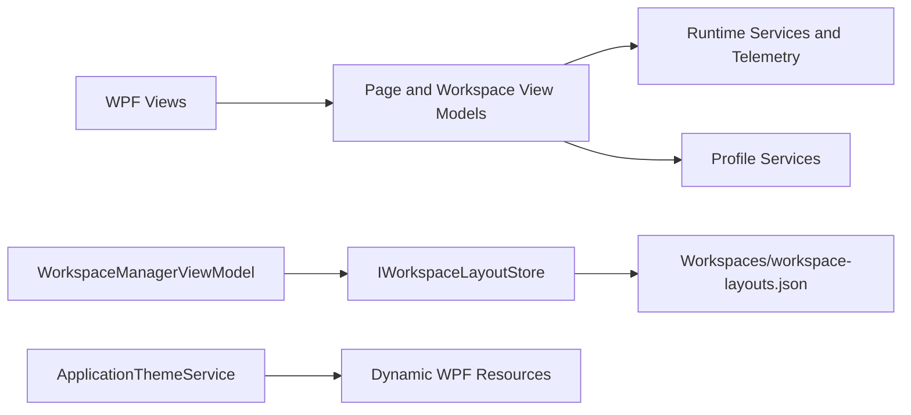

The center document region preserves existing pages. Optional left, right, and bottom tool panes consume shared view-model diagnostics and can be resized, moved, hidden, pinned, saved, and restored without affecting runtime or profile configuration. Workspace JSON stores UI layout only and is physically separate from profiles, settings, logs, diagnostics, and transform presets.

Light, Dark, and System themes change application resources only. `NotificationCenterViewModel` owns the current shell status plus a newest-first, 100-entry presentation history that begins after startup initialization. Structured logs and runtime telemetry remain the diagnostic sources of record.

## Testing And Replay Boundary

Testing infrastructure consumes normal runtime contracts rather than adding hardware-specific paths.

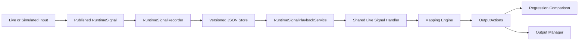

The recorder stores monotonic offsets and mapping-relevant signal data. Playback creates new signal IDs, rebases timestamps, retains the recorded ID in metadata, and marks every signal `Replayed` and `Synthetic`. Replayed signals are not re-recorded.

`JsonRuntimeSignalRecordingStore` owns atomic files under `Diagnostics/SignalRecordings`. `JsonRuntimeTelemetrySessionStore` owns versioned atomic files under `Diagnostics/PerformanceSessions`. Recordings, Test Runner reports, and Performance Profiler sessions are diagnostics artifacts, not profile or runtime-state persistence.

The Debug-only Test Runner consumes existing public services:

- `IInputProvider` for discovery and provider health;
- `ProfileValidator` for non-mutating profile analysis;
- `IOutputManager` for plugin/driver diagnostics;
- `IRuntimeWorkScheduler` for queue health;
- isolated `MappingEngine` and `AxisProcessor` instances for benchmarks;
- `IRuntimeSignalRecordingStore` and playback for regression sessions.

No Test Runner suite communicates directly with Windows HID or output plugin implementations.

### Chapter 14 Requirement Status

| Requirement | Status |
| --- | --- |
| Automated Core and Integration tests | Complete foundation, 120 passing tests |
| Five simulation profiles and scripted input | Complete |
| Versioned RuntimeSignal recording/playback | Complete foundation |
| OutputAction regression comparison | Complete foundation |
| Hardware compatibility matrix and manual procedures | Complete documentation; physical validation remains ongoing |
| Debug-only Test Runner with JSON/HTML export | Complete |
| Continuous Integration and hardware lab automation | Deferred |

## Feature Policy And Release Composition

Feature availability is resolved by the UI-independent `IFeatureFlagService` before output plugins, plugin discovery, diagnostic sampling, and navigation are composed.

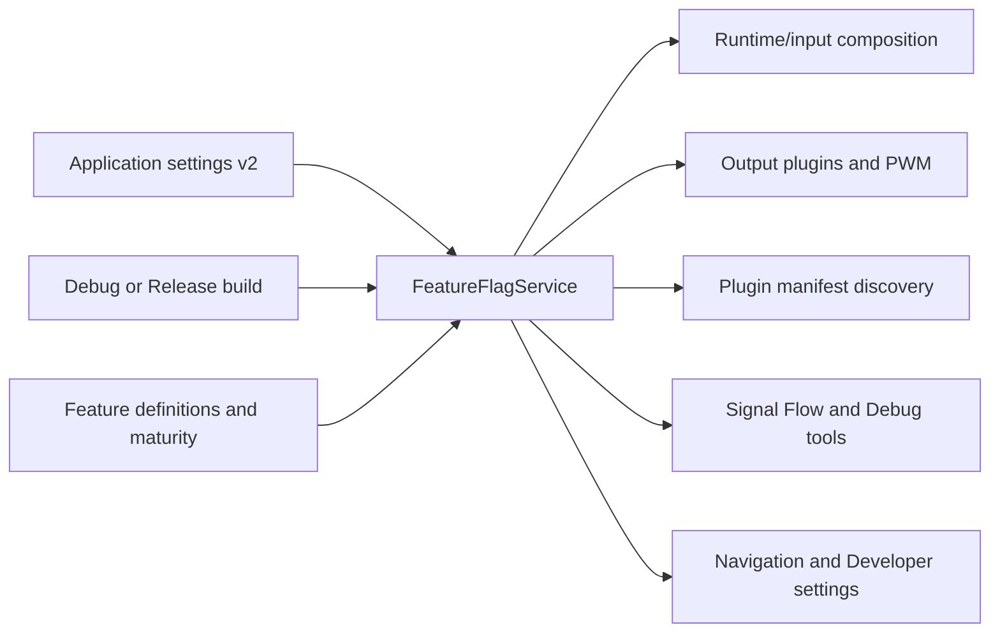

Build restrictions have precedence over persisted overrides. Release cannot activate Debug-only or Hidden code. Experimental Release features require the separate developer opt-in before their individual override can become effective. Current composition flags require restart; active input/output services are never replaced in place.

Feature settings are application configuration, not profile behavior. Profiles retain mappings and transform configuration while the responsible feature is disabled.

### Chapter 16 Requirement Status

| Requirement | Status |
| --- | --- |
| Incremental roadmap through public 1.0 | Complete documentation |
| Central Semantic Version and release channels | Complete foundation |
| Repeatable candidate/release gates | Complete tooling; clean-machine acceptance remains manual |
| Stable/Beta/Experimental/DebugOnly/Hidden flags | Complete |
| Persisted overrides independent from profiles | Complete, application settings schema v2 |
| Runtime composition boundaries | Complete for Keyboard, PWM, plugin discovery, Signal Flow, recording/playback, and Debug tools |
| Release exclusion for developer tools | Complete through compile-time and runtime policy |
| Automated policy/persistence/output regression coverage | Complete, 137 total tests |

## Project Health And Release Evidence

Release-readiness data is a UI-independent, versioned report. The application copies the tracked JSON snapshot into output and loads it through a validating provider.

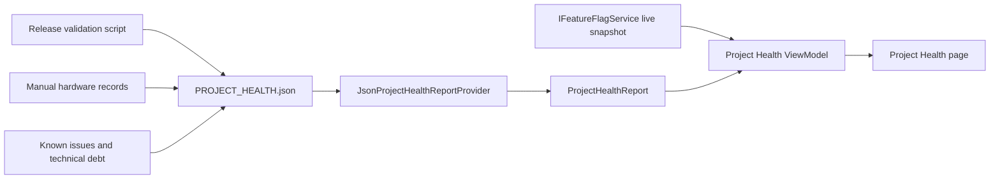

The provider validates schema, ranges, counts, and unique IDs. Failure returns a blocked fallback and records a structured error; release evidence cannot crash startup. The WPF page reads the report and live feature policy but has no hardware, mapping, output, or persistence write path.

The release-validation script remains outside the runtime. It restores dependencies, builds both configurations, runs tests and coverage, checks documents/schemas/artifacts, and writes an ignored per-run summary. Manual hardware and external packaging gates are never inferred from automated success.

### Chapter 17 Requirement Status

| Requirement | Status |
| --- | --- |
| Restore, Debug build, Release build | Automated |
| Functional regression suite | Automated foundation; manual hardware checks pending |
| Coverage measurement | Complete for runtime assemblies; WPF uses UI validation |
| Hardware acceptance | Partial, explicit release blocker |
| Performance acceptance | Tooling complete; release soak record pending |
| Reliability acceptance | Automated foundation; physical reconnect/sleep checks pending |
| Documentation set | Complete foundation |
| Project Health page | Complete |
| Installer/signing artifacts | Complete; certificate-backed release publication confirmed without repository credentials |
| Clean-machine install/upgrade/repair/rollback/uninstall evidence | Pending manual release gate |

## Chapter 18 Visual Node Editor

The Visual Node Editor is an alternate presentation over the same profile-owned InputMapping used by every mapping surface. Profile schema v9 adds an optional graph; mappings without one retain the existing ordered transform runtime.

The persisted graph is owned by Core Domain. Projection and editing live in Core Graphs. MappingGraphRuntime compiles a bounded acyclic plan and feeds its result into the established output-mapping stage. App owns only WPF interaction and workspace layout callbacks.

Runtime flow:

    InputMapping -> optional graph validation/compilation
                 -> RuntimeSignal graph execution
                 -> existing output mapping
                 -> OutputAction batch

Transform graph nodes reference mapping-owned transform configurations. Logic nodes provide deterministic AND, OR, NOT, and Compare operations. Plugin nodes execute only processors registered by application composition; unknown types are preserved and disable only their mapping. This does not enable external plugin loading.

Direct port editing rejects type mismatches and cycles before mutation. Edit-session snapshots include graph topology and transforms for undo/redo. Profile comparison, merge, health, migration, persistence, and mapping duplication include graph state and identities.

Node position and zoom are workspace presentation state. Viewport culling begins above 75 nodes; profile validation rejects more than 4,096 nodes or 16,384 connections. Runtime execution never depends on visible WPF nodes.

Existing schema-v8 and earlier profiles migrate to v9 without graph materialization. A branching graph is never silently flattened. Multiple outputs, cross-mapping graphs, loops, external plugin/script nodes, and generated online graphs remain deferred.

### Requirement Status

| Requirement | Status |
| --- | --- |
| Existing mappings represented as graphs | Complete |
| Shared traditional/graph mapping ownership | Complete |
| Optional versioned branching persistence | Complete in schema v9 |
| Stable typed ports and direct connection editing | Complete |
| Deterministic logic nodes | Complete |
| Registered internal plugin-node extension point | Complete |
| Live values, timing, warnings, and errors | Complete |
| Search, templates, zoom, pan, minimap, selection, history | Complete |
| Persisted workspace positions and zoom | Complete in workspace schema v3 |
| Large-graph viewport rendering | Complete |
| Invalid graph isolation | Complete |
| External plugin/script nodes and multiple outputs | Deferred behind separate reviews |
## Chapter 23 Architecture Governance

Architecture rules are data, tooling, documentation, and review responsibilities rather than convention alone.

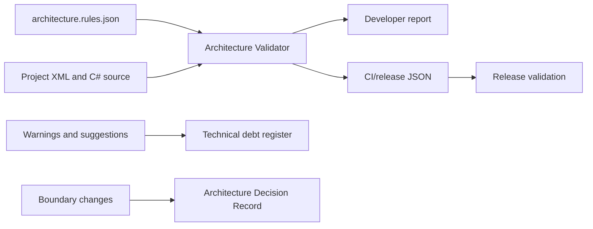

The validator is a BCL-only developer tool and does not reference runtime or WPF projects. The policy explicitly describes allowed project references, WPF ownership, solution membership, public documentation scope, composition roots, and implementation namespace boundaries. This preserves dependency direction without making the application depend on development tooling.

Hard violations fail the normal gate. Source-pattern checks remain warnings or suggestions because they are conservative heuristics and existing working behavior has priority over mechanical refactoring. Findings must remain visible in the debt register until corrected or superseded by an approved ADR and policy update.

### Requirement Status

| Requirement | Status |
| --- | --- |
| Coding and naming standards | Complete documentation plus compiler/editor enforcement |
| Project structure and dependency guidance | Complete foundation |
| Public API documentation rule | Complete for configured Core abstractions and Script API types |
| ADR process | Complete |
| Git workflow, commits, pull requests, and reviews | Complete documentation |
| Testing and dependency expectations | Complete documentation |
| Architecture dependency and WPF checks | Complete automated gate |
| DI registration validation | Complete for the current Microsoft DI composition root and registered service graph |
| Public service test validation | Complete automated baseline; the validator currently reports no suggestions |
| CI integration | Complete through release validation; hosted pipeline remains repository-host dependent |
| Legacy boundary cleanup | Complete for the current milestone; future cleanup requires new evidence and a scoped debt item |

## Easy Input/Output Milestone

The milestone extends, rather than replaces, the existing pipeline:

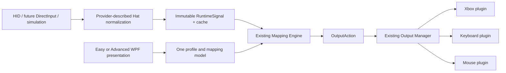

`HatState` preserves raw provider data while standardizing direction and center-button metadata. `HatMappingSignalAdapter` applies mapping-owned diagonal policy before the established transform/action path. `MouseOutputPlugin` owns pointer scheduling and cleanup. Easy presets create ordinary mappings. Profile schema v9 stores the schema-v7 hat/pointer configuration, descriptor-authoritative mapping behavior, and optional branching graphs; application settings v5 store presentation/layout/provider-override preferences.

The architecture decision and schema acceptance are recorded in ADR 0003 and the 2026-07 Easy Input/Output review. Physical hardware evidence remains separate from automated contract validation.

## Head-Tracking Extension

Head tracking is an additive side pipeline with the same output boundary:

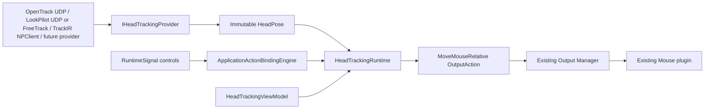

Boundary rules:

- provider implementations live in Input and publish provider-neutral poses;
- the Core runtime owns centering, tuning, smoothing, activation, recovery, diagnostics, and bounded pose delivery;
- physical activation remains an ordinary immutable RuntimeSignal and is resolved by a generic internal application-action engine;
- pass-through decides whether an action-bound signal continues to mapping/macro processing;
- only Output Manager dispatch reaches the Mouse plugin and Windows SendInput;
- WPF observes snapshots and changes profile configuration but never reads a provider directly.

Profile schema v10 adds only action bindings and head-tracking configuration. All provider health, pose, activation, center, smoothing, queue, and output values remain runtime-only.

OpenTrack UDP, both LookPilot interfaces, and TrackIR are available. LookPilot opentrack mode shares the loopback UDP transport; LookPilot FreeTrack mode uses the standard `FT_SharedMem` mapping behind a separate provider. TrackIR dynamically loads the user-installed NaturalPoint NPClient library, verifies its documented signature, and converts native packed frames behind the same provider boundary. All providers publish the same provider-neutral pose contract and retain distinct profile/diagnostic identities. Tobii, Webcam AI, and OpenXR use the same future provider slot. Native game head-pose and virtual-joystick outputs remain unimplemented extension points.
