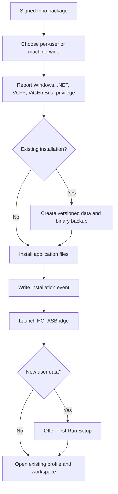

# Deployment Architecture

## Chapter 22 Assessment

| Requirement | Status | Implementation |
| --- | --- | --- |
| Standard/per-user/machine-wide install | Implemented source | Inno Setup privilege override and stable AppId |
| Portable install | Deferred | `InstallationScope.Portable` is modeled and rejected explicitly |
| Prerequisite detection | Implemented | Installer report plus UI-independent `IDeploymentAssessmentService` |
| Driver detection and explicit install | Implemented | Shared `IVirtualGamepadDriverService`; wizard owns the explicit action |
| Upgrade preservation and backup | Implemented | Inno pre-install hook plus versioned ZIP service/scripts |
| Rollback | Implemented foundation | Inno transaction rollback and validated restore script |
| Uninstall data choices | Implemented | Separate profile/settings/log/backup confirmations; preserve by default |
| Automatic online updates | Deferred | Offline service and signed/confirmed update policy only |
| First Run Wizard | Implemented | Nine-step WPF MVVM workflow over runtime services |
| Signed public artifact | Tooling implemented; external release gate | Certificate-store signing, trusted timestamps, checksums, verification, and acceptance evidence are source-controlled; production identity and clean-machine sign-off remain external |

## Boundaries

Deployment policy and immutable results live in `HOTASBridge.Core`. Windows and filesystem implementations live in `HOTASBridge.Infrastructure` or `HOTASBridge.Output`. WPF consumes interfaces and never probes the registry or launches installers directly.

| Interface | Responsibility |
| --- | --- |
| `IDeploymentAssessmentService` | Windows, runtime, optional driver, and privilege assessment |
| `IVirtualGamepadDriverService` | Single ViGEmBus status and explicit bundled-installer boundary |
| `IDeploymentBackupService` | Versioned backup and path-contained restore |
| `IUpdateService` | Channel-aware update-check/install extension point |

`OfflineUpdateService` is intentionally non-networked. It lets Settings and future update UI bind to a stable contract without implying an available service.

## Installation Flow



The installer does not mutate profiles or settings. Profile migrations remain owned by `JsonProfileStore`, which creates its own exact pre-migration backup.

## First Run Flow

`FirstRunWizardPolicy` decides whether startup should offer setup:

- explicit request always opens it;
- Safe Mode suppresses automatic setup;
- completed or user-skipped setup stays closed;
- existing settings/profile/workspace data stays closed;
- a new unconfigured installation opens it.

The wizard is skippable. Completing it applies one atomic result through `MainViewModel`: selected stable device identities, selected/new profile, and an optional starter mapping. It never persists current signal or output state.

## Backup Format

Deployment backups are ZIP archives with schema `1`:

```text
deployment-manifest.json
Data/
  settings.json
  Profiles/
  Workspaces/
Application/                 optional
```

The manifest records application version, UTC creation time, source roots, application-file inclusion, and entries. Restore rejects unsupported schemas and any path that escapes the selected root.

The .NET backup service protects in-app manual backups and tests. `Backup-DeploymentData.ps1` is the installer pre-upgrade helper. Both use the same logical format.

## Upgrade and Rollback

1. Inno detects the stable AppId and previous application path.
2. `PrepareToInstall` extracts the bundled backup helper to Inno's temp directory.
3. The helper archives data and previous binaries before setup writes files.
4. A backup failure aborts setup before changes.
5. Inno owns active-transaction rollback.
6. `Restore-DeploymentBackup.ps1` restores the additional archive when a previous installation must be reinstated manually.

Runtime outputs are never backed up or restored. No key, Xbox button, PWM timer, macro execution, or scheduler state survives an upgrade.

## Package Build

`scripts/Build-Installer.ps1` performs:

1. Release `dotnet publish` for `win-x64`.
2. Application and bundled ViGEmBus payload verification.
3. Optional certificate-store signing of first-party HOTASBridge executables and assemblies.
4. Inno Setup compilation with the same signer for setup and uninstaller.
5. Authenticode verification for a required signed build.
6. Versioned JSON release-manifest and SHA-256 sums generation.

Unsigned developer package:

```powershell
.\scripts\Build-Installer.ps1 -Configuration Release -Version 0.27.0
```

Fail-closed signed package:

```powershell
.\scripts\Build-Installer.ps1 -Configuration Release -Version 0.27.0 `
  -SigningCertificateThumbprint '<thumbprint>' `
  -SigningCertificateStoreLocation CurrentUser `
  -TimestampUrl 'http://timestamp.digicert.com' `
  -RequireSigning
```

The output directory contains `HOTASBridge-0.27.0-Setup.exe`, `HOTASBridge-0.27.0-release.json`, and `HOTASBridge-0.27.0-SHA256SUMS.txt`. `Verify-ReleaseArtifacts.ps1` independently verifies the set. The scripts use a certificate already installed in the Windows certificate store and never accept private-key material or a password.

## Package Layout

```text
HOTASBridge.App.exe
HOTASBridge.*.dll
Drivers/ViGEmBus/ViGEmBus_1.22.0_x64_x86_arm64.exe
ProjectHealth/project-health.json
Deployment/Restore-DeploymentBackup.ps1
```

## Signing and Release

A locally compiled installer is a development artifact. Public release requires:

- Authenticode signature on application and setup executables;
- trusted timestamp;
- SHA-256 checksums;
- malware scan;
- clean-machine installation and uninstall evidence;
- retained previous-build upgrade rehearsal;
- release notes and supported runtime matrix.

## Disposable-Machine Acceptance

`Invoke-DeploymentAcceptance.ps1` is intentionally destructive and refuses to run without `-DisposableMachineConfirmed`. It requires valid signatures, a signed candidate manifest, a different retained installer, and empty install/data roots. It records host details, every Inno log, step timings, and failures in a schema-versioned JSON report.

```powershell
.\scripts\Invoke-DeploymentAcceptance.ps1 `
  -CandidateInstallerPath '<candidate-setup.exe>' `
  -CandidateManifestPath '<candidate-release.json>' `
  -RetainedInstallerPath '<retained-setup.exe>' `
  -Scope CurrentUser `
  -IncludeUninstallChoiceMatrix `
  -DisposableMachineConfirmed
```

The sequence covers retained-build install, candidate upgrade and backup, archive rollback, candidate reinstall, corrupt-binary repair, preserve-by-default uninstall, and optionally all 16 user-data removal combinations. Supplying the switch records an operator attestation; it does not automatically prove that a Windows image is clean.

## Failure Isolation

- Missing optional ViGEmBus disables only virtual Xbox output.
- Missing required .NET blocks the framework-dependent installer before file changes.
- Backup failure blocks upgrade before file changes.
- Update services cannot stage unsigned or unconfirmed packages.
- Uninstall does not remove any user-data category without confirmation.
