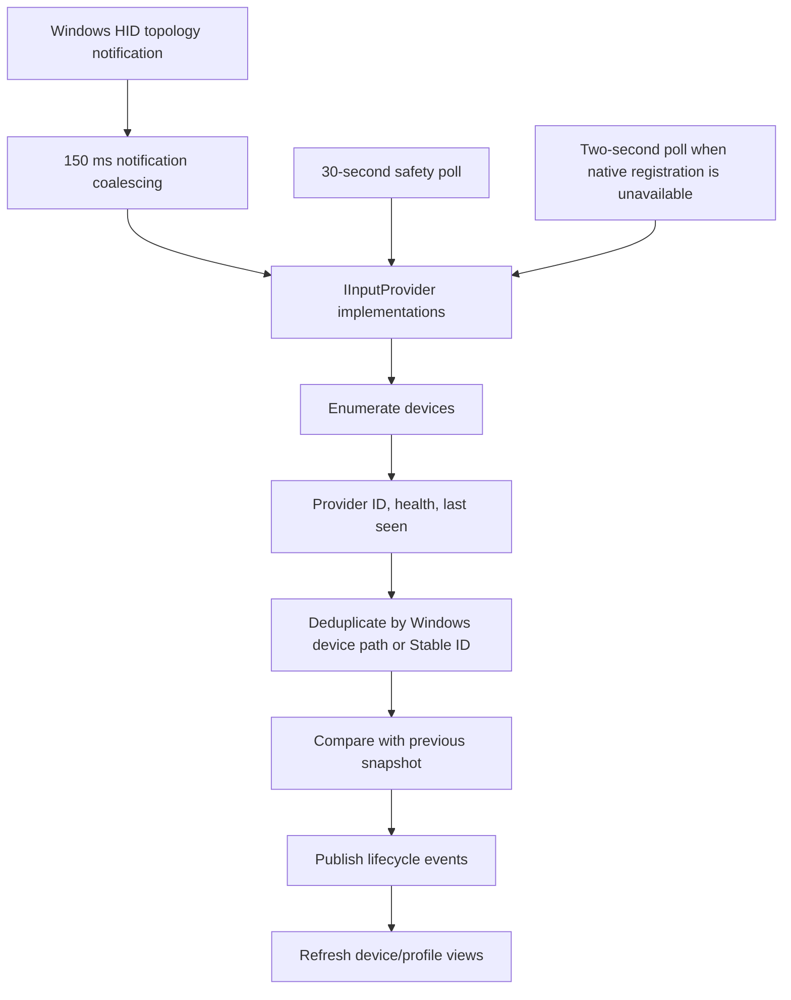

# Device Discovery

## Discovery Flow



`CompositeInputProvider` performs an initial baseline enumeration during initialization and then monitors automatically. On Windows, an Input-layer message-only window registers for HID interface notifications. Notification bursts are coalesced for 150 ms before the existing enumeration path runs.

## Lifecycle

```stateDiagram-v2
    [*] --> Connected: first discovery
    Connected --> Active: signal received
    Active --> Idle: no signal for two seconds
    Idle --> Active: signal received
    Connected --> Disconnected: absent from discovery
    Active --> Disconnected: absent from discovery
    Idle --> Disconnected: absent from discovery
    Disconnected --> Connected: reconnected
    Connected --> Error: provider error
    Active --> Error: provider error
```

Lifecycle event kinds supported by the contract:

- Connected
- Disconnected
- Reconnected
- Suspended
- Resumed
- Error

Native arrival, removal, and topology messages trigger comparison that emits Connected, Disconnected, and Reconnected. A 30-second safety poll catches missed notifications; if native registration cannot start, discovery automatically uses the previous two-second poll. Provider errors are published separately and reflected in health. Native suspend/resume hooks are deferred.

## Deduplication

Windows HID and Raw Input can describe the same physical interface. The composite manager:

1. Enumerates providers in configured priority order.
2. Groups records by Windows Device Path when available.
3. Falls back to Stable ID when no path is available.
4. Keeps the first record, currently the richer Windows HID record.

This prevents Raw Input corroboration from appearing as a second controller.

## Source Filtering

Discovery honors:

- Physical Devices
- Virtual Devices
- Physical and Virtual Devices

Simulation devices use the same filter semantics but remain hidden by default in the UI. Enabling demo devices changes visibility only; it is not required to discover real hardware.

## Reconnection

Profile device presence is recalculated after lifecycle refresh using `DeviceIdentityMatcher`. Exact IDs are preferred, followed by GUID, Container ID, serial, path, VID/PID, usages, and name. Windows HID discovery reads the Container ID from the interface device node. Existing profile selections are backfilled when that identity becomes available, even if their Stable ID did not change, and the value is persisted on the next profile save.

## Threading

- Native HID report readers run background tasks.
- Discovery monitoring runs a cancellable background task.
- Native notifications use a private message-only Win32 window on one background thread; no WPF window handle is involved.
- Native bursts are coalesced before enumeration, and all native/safety/manual refreshes retain the existing asynchronous serialization gates.
- Enumeration is serialized by an asynchronous semaphore.
- Lifecycle and signal events are raised outside internal snapshot locks.
- `MainViewModel` dispatches only UI collection updates to WPF.

## Error Handling

- Provider enumeration errors return an empty provider result and publish `InputProviderErrorEventArgs`.
- Other providers continue to enumerate.
- Provider status changes to Error and device health reflects it.
- Cancellation is not reported as an error.
- Native registration or message-loop startup failure is logged as a warning and activates two-second polling without failing application startup.
- Shutdown cancels monitoring, unregisters notifications, closes the message window, and then disposes providers.

## Diagnostics

The Input Manager publishes:

- provider count and statuses;
- connected, active, and idle device counts;
- enumerated control count;
- RuntimeSignal publication totals and latency;
- connection/error events to logs and UI diagnostics;
- native notification availability, received count, notification refresh count, and fallback polling refresh count.

The WPF Devices page consumes the discovered-device projection through `DeviceBrowserViewModel`. `DevicesView` owns only presentation and remembered grid-column layout; it does not enumerate hardware or bypass the input/provider boundaries.

## Known Limitations

- HID interface notifications normally refresh after the 150 ms coalescing window plus enumeration time. If native registration is unavailable, connection changes can take up to roughly two seconds.
- Raw Input is discovery-only; live input uses the richer HID reader.
- DirectInput is not implemented.
