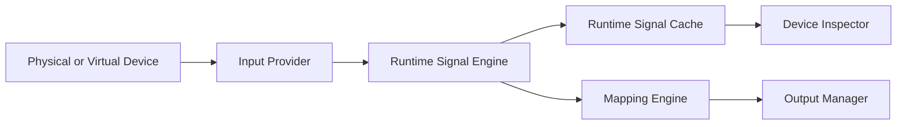

# Device Inspector

The Device Inspector is a read-only live diagnostics surface. Each enabled profile device has its own tab. It consumes immutable values from `IRuntimeSignalCache`; it never reads Windows HID APIs or provider implementations directly.

## Requirement Status

| Capability | Status | Notes |
| --- | --- | --- |
| Per-device tabs | Implemented | Existing profile-device tabs preserved. |
| Device summary | Implemented | Name, manufacturer, type, VID/PID, connection/runtime state, poll activity, firmware availability, and control count. |
| Axis diagnostics | Implemented | Raw, normalized, output, percentage bar, deadzone, curve, observed range, and quality state. |
| X/Y visualizer | Implemented | Existing live cursor, center/deadzone marker, grid, and saturation boundary preserved. |
| Unlimited buttons | Implemented | Controls are generated from discovery without a 32-button cap; state and last activation are retained. |
| Hats | Implemented | A 3x3 cardinal/diagonal/center grid highlights live direction and center press while retaining raw/provider/mapping diagnostics. Device-specific 5/9-way press semantics depend on provider metadata. |
| Encoders and switches | Implemented | Encoder cards show last direction and independent CW/CCW/total pulses; switch cards show normalized position plus current/previous values. Semantic vendor-specific classification remains provider-dependent. |
| Unknown controls | Implemented | `InputControlType.Unknown` controls remain visible with usage and current state available to export. |
| Event log and filters | Implemented | Time, control, previous/new value, type, severity; All/Button/Axis/Hat/Warning/Error filters. |
| Performance | Implemented | Events/sec, average observed interval, processing latency, and missed-report placeholder. |
| Mapping preview | Implemented | Mapping behavior, output, profile, transform chain, and navigation to Mapping Editor. |
| Freeze/reset/export | Implemented | Freeze affects display only; statistics reset and JSON/CSV/text exports are available. |

## Runtime Data Flow



`DeviceInspectorViewModel.Apply` uses the signal notification only as an invalidation hint. It retrieves the latest matching immutable signal from the cache before updating the display. Freeze returns before all display mutation while the runtime continues publishing, mapping, and outputting signals.

## Layout

`DeviceInspectorView` owns the WPF tabbed presentation and binds directly to `ProfileDeviceTabsViewModel.Tabs`. Selected-device state remains shared with mapping and learn workflows; the view does not own profile or runtime state.

Each tab contains:

1. Device identity, connection, runtime, and control-count summary.
2. Live axes and X/Y position.
3. Dynamically generated buttons.
4. Performance metrics and mapping preview.
5. Live 3x3 hat grids, encoder pulse-direction cards, switch position tracks, and unknown-control rows.
6. Filtered event history.

No control list is truncated to a legacy HID button count.

## Performance Metrics

- Events/sec is calculated from signals displayed since the last reset.
- Average poll interval is the running average between received signals for the device.
- Processing latency is wall-clock time from the signal timestamp to UI consumption.
- Missed reports is `0` until a provider exposes a reliable sequence/report-loss counter.

These values do not change provider polling or mapping scheduling.

## Mapping Preview

Selecting a discovered control shows the first enabled profile mapping for that device/control pair. The preview includes the assigned Xbox output and configured processing path. Edit Mapping switches to the Mapping Editor with the same device and control selected.

## Export Formats

All exports are generated from `DeviceDiagnosticsDocument` in Core.

### JSON

A structured document containing device identity, capture time, performance, controls, current cache values, and recent events.

### CSV

A multi-section CSV containing device fields, performance metrics, one row per control, and recent events:

```text
ControlId,DisplayName,ControlType,UsagePage,UsageId,RawValue,NormalizedValue,CurrentValue,State,Quality,LastUpdateUtc
```

### Text

A human-readable support report containing device summary, performance, controls, and recent events.

## Deferred

- Firmware retrieval when providers expose it.
- Provider report sequence counters for measured missed reports.
- Device-specific encoder and multi-position switch semantic classification.
- Separate raw and processed cursors/curve overlay in the X/Y control.

## Hat / D-pad Diagnostics

Every normalized hat remains visible even when the provider calls it POV or D-pad. The inspector shows:

- a directional visual with cardinal and diagonal highlights;
- normalized direction;
- original raw value;
- provider and encoding;
- direction count;
- centered/active state;
- separate center-button state;
- last change time;
- current mapping count.

The event filter includes Hats/POV so short transitions can be isolated without hiding unknown controls. All values come from the Runtime Signal Cache; the inspector never polls HID directly. PlayStation-style controls use the friendly label `D-pad / Hat 1` where provider enumeration identifies that role.

## Encoder And Switch Diagnostics

Encoder cards preserve independent clockwise, counter-clockwise, and total pulse counters. The most recently observed `cw` or `ccw` qualifier is emphasized, and the last pulse timestamp remains visible. Switch cards project normalized values onto a stable 0-100% track and show current, previous, percentage, and last-change values. Both card types retain the same blue Learn Mode selection outline used by axes, buttons, and hats.

Provider-specific absolute encoder positions, maintained-contact names, and multi-position semantics remain data-provider responsibilities. Unknown or unsupported values remain visible rather than being hidden.
