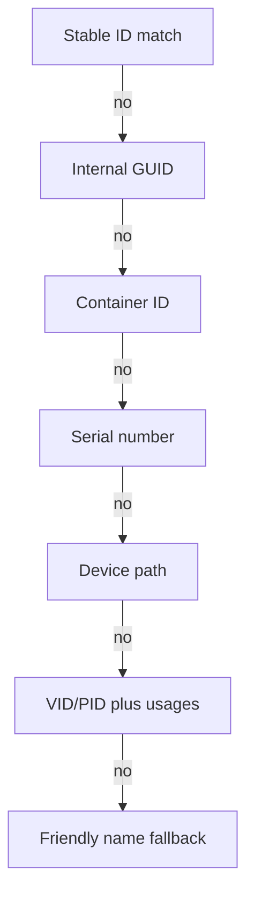
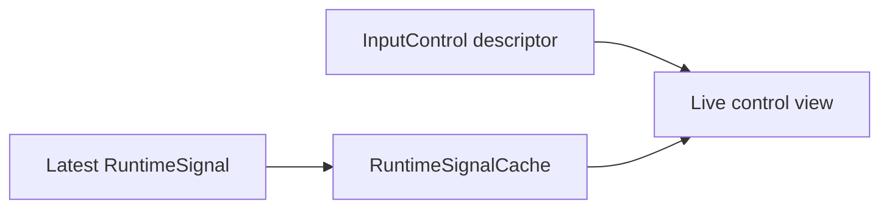

# Device Model

## InputDevice

`InputDevice` represents one independent physical, virtual, or simulated device.

| Field | Meaning |
| --- | --- |
| Identity | Stable and fallback identifiers. |
| ProviderId | Provider that supplied the preferred deduplicated record. |
| DeviceType | Joystick, throttle, pedals, gamepad, button box, virtual, keyboard-like, or composite. |
| IsConnected | Current discovery presence. |
| Health | Connected, Active, Idle, Error, Unsupported, Disabled, or Disconnected. |
| LastSeenUtc | Latest discovery or signal timestamp. |
| Controls | Static control descriptors owned by the device. |
| Capabilities | Derived axis/button/hat/encoder/switch and total control counts. |

## Identity Strategy

Profiles never rely solely on a display name. Reconnection matching uses the strongest available identifier in this order:

1. Exact HOTASBridge Stable ID.
2. Internal Device GUID.
3. Windows Container ID.
4. Serial Number.
5. Device Path.
6. Vendor ID and Product ID.
7. Usage Page and Usage ID.
8. Friendly Name.



Existing Stable IDs are preserved to avoid breaking saved profiles. GUID and Container ID profile fields remain nullable, so existing JSON stays compatible. Windows HID discovery now reads `DEVPKEY_Device_ContainerId` from SetupAPI, validates it as a non-empty GUID, and leaves the field null when Windows does not expose a usable value.

## DeviceIdentity Fields

- Stable ID
- Display/Friendly Name
- Product Name
- Manufacturer
- Vendor ID
- Product ID
- Usage Page
- Usage ID
- Internal Device GUID
- Container ID
- Serial Number
- Device Path
- Physical, Virtual, or Simulated source kind

## Control Model

`InputControl` is the static descriptor:

- Control ID
- Display Name
- Axis, Button, Hat, Encoder, or Switch type
- HID Usage Page and Usage ID
- Logical minimum and maximum
- Bipolar or unipolar range
- Derived control capabilities

Live state remains separate from static discovery data:



The latest RuntimeSignal supplies current state, raw value, normalized value, previous value, timestamp, quality, and diagnostics. This avoids mutable hardware state inside profile/discovery models.

## Control Enumeration

Windows HID reads preparsed data and value/button capabilities. It supports:

- generic desktop axes including X, Y, Z, rotations, slider, dial, and wheel;
- buttons beyond legacy 32-button limits;
- hats/POV controls;
- HID logical ranges for signed and unsigned normalization;
- vendor controls represented by stable usage/control IDs where available.

The native value-capability layout and usage-range parser are shared by enumeration and monitoring. Automated layout and conversion tests protect the interop boundary without requiring attached hardware; model-specific report behavior remains part of the hardware compatibility checklist.

Encoders and multi-position switches use the common control model; device-specific semantic classification remains extensible.

## Device Groups

A `HotasProfile` contains multiple `ProfileDeviceSelection` records. Each selected device remains independent and mappings retain its Stable Device ID. Together they form a logical cockpit without merging device identity or control namespaces.

Example:

```text
Profile: F-16 Cockpit
  Stick
  Throttle
  Rudder Pedals
  Button Box
  MFD Panel
```

A disconnected member is marked unavailable while the remaining group continues to operate.

## Compatibility

Adding health, provider, product, GUID, and Container ID fields is additive. Existing profiles, mappings, Stable IDs, and JSON files remain valid. Discovery reconciliation backfills newly available Container IDs into loaded profiles without rewriting mapping references; a normal profile save makes the metadata durable.

## Hat and Provider Metadata

`InputControl.Hat` is optional and meaningful only for Hat controls. It describes how the owning provider encodes raw values; it does not store live state. Published `InputEvent.HatState` and RuntimeSignal metadata contain:

- original raw value;
- normalized direction and centered flag;
- provider and encoding;
- declared direction count;
- separate center-button state.

`InputDevice.ProviderCorrelation` reports the preferred provider, correlated provider IDs, whether the Advanced override included duplicates, and a warning. Correlation metadata is diagnostic and is never persisted as runtime state.
