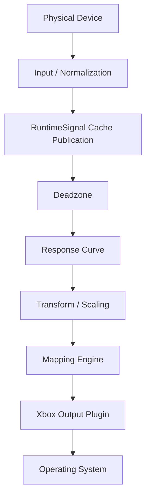

# Diagnostics

HOTASBridge diagnostics are runtime services, not UI behavior. The Developer Dashboard, Device Inspector, diagnostics export, Signal Flow Inspector, and Macro Debugger consume the same immutable cache and telemetry snapshots. The Advanced Diagnostics page and workspace pane read the bounded `RuntimeActivityViewModel.Diagnostics` feed directly; `MainViewModel` does not duplicate that collection.

## Shared Contracts

| Contract | Purpose |
| --- | --- |
| `IRuntimeSignalCache` | Latest immutable signal for every active device/control pair. |
| IRuntimeTelemetry | Metrics, rates, durations, statuses, and stage snapshots. |
| IRuntimeEventBus | Ordered typed notification of signal, stage, profile, plugin-lifecycle, and output-diagnostic changes plus delivery-health counters. |
| `RuntimeTelemetrySessionAnalysis` | UI-independent numeric snapshot capture, averaging, and two-session comparison. |
| `IRuntimeTelemetrySessionStore` | Versioned telemetry history persistence behind opaque storage IDs. |
| `RuntimeStageDiagnostic` | Stage input/output, enabled state, duration, warning/error, description, source identity, pipeline, and order. |
| `VirtualGamepadBackendDiagnosticSnapshot` | Cumulative connection, submission, cleanup, total, and last-failure evidence for the virtual-gamepad backend. |
| `IMacroEngine` | Immutable macro, variable, trigger, timing, scheduler, and error snapshots plus debugger commands. |
| `DeviceDiagnosticsDocument` | UI-independent device export snapshot. |
| `DeviceDiagnosticsExporter` | JSON, CSV, and text serialization. |

## Structured Logging

`JsonFileLog` preserves the UI-independent `IStructuredLog` call surface. Producers serialize and enqueue events into a bounded 8,192-entry channel; one background writer coalesces up to 128 events or 100 ms of activity into each disk flush. Explicit `FlushAsync` requests are ordering barriers, and coordinated shutdown drains the queue before disposal.

Settings > Diagnostics configures retention from 1 to 365 days; the default is 14. Retention recognizes only UTC daily files named `hotasbridge-YYYYMMDD.jsonl`. The current file, recent files, unrelated files, and malformed names are preserved. Policy changes are applied by `ILogRetentionController` and persisted in application settings schema v6.

Shared telemetry exposes queue depth/peak, rejected events, events and batches written, retention days, expired files removed, retention failures, and Logging health. A rejected event or retention failure changes Logging health to Warning without stopping other runtime subsystems.

## Virtual Gamepad Backend Diagnostics

`VirtualXboxOutputService` counts ViGEm connection creation, report submission, and cleanup failures at the native boundary. `XboxOutputPlugin` includes the immutable snapshot in its ordinary output diagnostics; `OutputManager` then publishes per-category gauges, a total gauge, backend health, and a warning on the existing output stage. Output Monitor reads that same manager snapshot and never calls ViGEm directly.

Counters are cumulative for the current process so an automatically recovered backend does not erase earlier evidence. Cleanup exceptions remain contained to preserve shutdown, but each failed disconnect or dispose operation is counted. Hardware-independent tests inject an internal session implementation; physical driver/game acceptance remains manual.

## Signal Flow Inspector

The advanced page selects one profile device and control, then filters stage diagnostics by `SourceDeviceId` and `SourceControlId`.

Only stages that execute appear. Disabled configured stages remain represented when their pipeline publishes diagnostics. The output plugin and operating-system boundary are appended to complete the visible route.

Each stage displays current input/output values, duration, enabled state, Normal/Warning/Error status, last update, and a human-readable description.

Live mode refreshes every 125 ms. Freeze stops page refresh only. Runtime input, mapping, output, cache updates, and telemetry publication continue.

## Diagnostic Metadata

`RuntimeStageDiagnostic` source fields are additive and backward compatible:

- `SourceDeviceId`
- `SourceControlId`
- `PipelineId`
- `StageOrder`

Input and mapping pipeline publishers populate these fields centrally. `InMemoryRuntimeTelemetry` stores the latest stage first and then publishes `RuntimeStageDiagnosticPublishedMessage`, so event consumers can always reconcile against an authoritative snapshot. Processing stages do not contain Signal Flow UI-specific code.

## Macro Diagnostics

Macro actions publish `RuntimeStageKind.Macro` diagnostics with source device/control identity and pipeline order. The Signal Flow Inspector includes them for the selected control.

The Macro Debugger samples `MacroEngineSnapshot` at 10 Hz only while visible. Pause, Resume, Stop, Restart, and Step commands operate through `IMacroEngine`; the page never accesses devices, schedulers, or output plugins directly. Runtime variable snapshots are read-only.
## Device Event History

Device history retains the newest 100 UI events per tab. Each record contains timestamp, control identity, signal type, previous value, new value, and diagnostic severity. This is a live support aid, not the future recorder format.

## Performance Isolation

- Cache reads return immutable snapshots.
- Telemetry reads lock only long enough to copy current values.
- The event bus snapshots subscribers under its registry lock and invokes handlers after releasing it.
- The Device Inspector performs no hardware calls; its hat, encoder, and switch visuals project existing cached signal metadata only.
- Freeze avoids UI collection mutation.
- Export serializes a point-in-time document after the user chooses a destination.

## Error Handling

Invalid signals remain visible with Invalid quality and stage error metadata. A diagnostics consumer cannot stop runtime processing.

## Future Work

- Single-step replay and persisted event history.
- Runtime signal recording/playback.
- Dedicated scheduler thread and queue-depth instrumentation.
- Provider-native missed-report counters.
- Broader plugin-instance correlation beyond the current mapping ID, plugin ID, control ID, action type, and Output Manager diagnostics.

## Script Diagnostics

The optional Scripting Engine publishes immutable engine and per-script snapshots through `IScriptEngine`. Each script reports lifecycle state, enabled/running state, execution count, cumulative CPU time, managed allocation estimate, last execution time and duration, pending event count, and last error.

The application adapter also publishes the shared Script runtime stage through `IRuntimeDiagnosticRegistry` and records script counters in `ITelemetryService`. Diagnostics consume these services; they do not inspect MoonSharp state or call scripts directly. A failed script is reported independently so it cannot hide the health of other scripts or output plugins.
