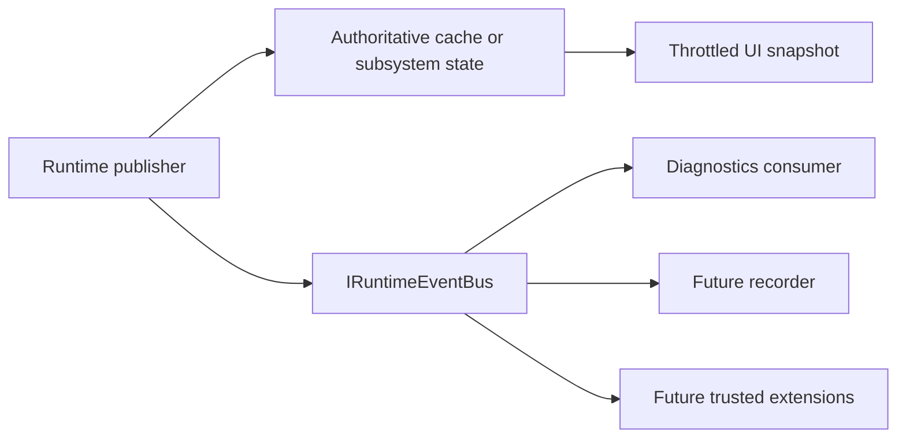

# Runtime Event Bus

## Purpose

`IRuntimeEventBus` is the UI-independent application-message boundary for runtime facts that more than one subsystem may consume. It extends the Chapter 3 signal publication foundation without replacing the latest-value cache, telemetry snapshots, output actions, or subsystem-specific commands.

The process owns one `RuntimeEventBus` instance. The composition root injects that instance into publishers and registers the interface for future consumers.

## Delivery Contract

- Messages implement `IRuntimeEvent` and carry an event ID, occurrence timestamp, and source.
- Publication is synchronous and preserves registration order for subscribers of the exact message type.
- One subscriber exception is logged and counted; later subscribers still receive the message.
- `Subscribe<TEvent>` returns an idempotent `IDisposable` lease. Consumers own and dispose that lease.
- Subscription and publication are thread-safe. A publish call snapshots subscribers before invoking them, so handlers execute outside the registry lock.
- Handlers must be short and non-blocking. Work that may block belongs on the runtime scheduler or another owned queue.
- Consumers cannot mutate the bus registry or another consumer's message.

`RuntimeEventBusSnapshot` exposes total and per-type publication, successful-delivery, failed-delivery, and active-subscriber counts for diagnostics.

## Current Messages

| Message | Publisher | Meaning |
| --- | --- | --- |
| `RuntimeSignalPublishedMessage` | Runtime Signal Engine | An immutable signal completed the input pipeline and entered the latest-value cache. |
| `RuntimeStageDiagnosticPublishedMessage` | Runtime Telemetry | One processing-stage diagnostic was refreshed. |
| `ProfilePersistenceChangedMessage` | Profile Persistence Coordinator | A profile was saved or an unchanged change-aware save was skipped. |
| `PluginLifecycleChangedMessage` | Plugin Catalog | A compatible runtime plugin committed a lifecycle transition. |
| `OutputPluginDiagnosticPublishedMessage` | Output Manager | One output plugin runtime snapshot was sampled. |

Existing .NET events remain as compatibility adapters where current callers still depend on them. New cross-subsystem consumers should prefer the typed bus and must not subscribe to both paths for the same operation.

## Relationship To State

Messages announce that something happened. They are not durable state. A late subscriber reads the appropriate cache, catalog, telemetry snapshot, profile store, or Output Manager snapshot to establish current state, then observes future messages.

## Failure And Performance Rules

- The bus never performs mapping or output work itself.
- Subscriber failure cannot terminate the publisher or prevent later delivery.
- The registry lock is never held while user code executes.
- Event counters use atomic updates and snapshot copies.
- RuntimeSignal messages reuse the already-frozen signal instance; the bus does not clone hot-path payloads.
- Stage and output messages reuse immutable diagnostic records.

Asynchronous fan-out, replay, durable queues, wildcard subscriptions, and remote transport are intentionally absent. Those capabilities require explicit ordering, backpressure, trust, and persistence designs before introduction.