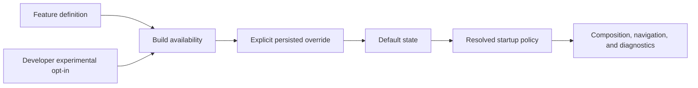

# Feature Flags

## Purpose

The feature policy allows incomplete or selectively supported capabilities to remain in the codebase without changing stable startup behavior. Policy evaluation lives in `HOTASBridge.Core.Features` and has no WPF dependency.

## Stages

| Stage | Default policy |
| --- | --- |
| Stable | Available in Debug and Release; may be enabled by default |
| Beta | Available in Debug and Release; default state is reviewed per release |
| Experimental | Disabled by default; Release requires developer opt-in before override |
| DebugOnly | Available only in Debug; Release overrides are ignored |
| Hidden | Omitted from normal settings; only a Debug explicit override can enable it |

The Debug dashboard, profiler, and test runner retain compile-time `DEBUG` exclusion in addition to runtime policy.

## Current Registry

| Key | Stage | Default | Startup boundary |
| --- | --- | --- | --- |
| `keyboard-output` | Stable | On | Keyboard output plugin composition |
| `mouse-output` | Stable | On | Mouse output plugin composition |
| `xbox-one-output` | Beta | Off | Optional HIDMaestro driver status, Xbox-family identity selector, and output plugin composition |
| `analog-pwm` | Stable | On | Keyboard PWM scheduler path |
| `signal-flow-inspector` | Beta | On | Inspector sampling and navigation |
| `recording` | Beta | On | Debug Test Runner recording commands |
| `playback` | Beta | On | Debug Test Runner playback commands |
| `plugin-sdk` | Stable | On | External manifest discovery |
| `project-health` | Stable | On | Release-readiness navigation and report |
| `node-editor` | Beta | On | Visual editor over the shared `InputMapping` model |
| macro-engine | Beta | On | Macro runtime composition, timer activation, and Macro Debugger navigation |
| script-engine | Experimental | Off | Lua discovery, lifecycle, event dispatch, and public Script API adapters |
| `experimental-transforms` | Experimental | Off | Reserved transform registration boundary |
| `developer-dashboard` | DebugOnly | On in Debug | Debug navigation and sampling |
| `performance-profiler` | DebugOnly | On in Debug | Debug navigation |
| `test-runner` | DebugOnly | On in Debug | Debug navigation |
| `ai-assistant` | Beta | On | Offline AI Explain service and five evidence-backed entry points |

Xbox 360 output is the baseline product output. The optional Xbox-family backend is independently feature-gated and disabled by default. Safe Mode remains an operational recovery policy rather than a development feature flag.

## Persistence

Application settings schema v2 stores only explicit overrides and the Release experimental opt-in:

```json
{
  "schemaVersion": 2,
  "allowExperimentalFeatures": false,
  "featureFlagOverrides": {
    "signal-flow-inspector": false
  }
}
```

Unknown keys are retained by settings persistence but ignored by the current catalog. This permits forward-compatible settings rollback without activating unknown code.

## Evaluation



Build restrictions take precedence over persisted values. A Release setting cannot activate Debug-only or Hidden code. All current flags require restart so active output services are never replaced in place.

## Adding a Feature

1. Add a stable `FeatureId` and kebab-case key to `FeatureFlagCatalog`.
2. Assign stage, conservative default, description, and restart behavior.
3. Gate the real service/registration/runtime boundary, not only its button.
4. Preserve existing saved configuration when the feature is disabled.
5. Add resolution, persistence, and subsystem behavior tests.
6. Add diagnostics for disabled/unavailable behavior where users may need an explanation.
7. Document migration impact and promotion criteria.

Do not use feature flags as a permanent substitute for deleting obsolete code or for error recovery.
