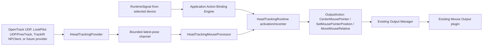

# Head Tracking

## Scope

The first head-tracking milestone adds a provider-neutral input path and Mouse Free Look output without changing the existing HID, mapping, transform, or output plugin contracts.

Implemented:

- a six-degree-of-freedom immutable `HeadPose` model;
- an extensible `IHeadTrackingProvider` boundary and provider catalog;
- OpenTrack UDP, LookPilot opentrack UDP/FreeTrack, and native TrackIR NPClient input;
- Hold and Toggle activation from an existing selected-device button or switch;
- Learn Next Button, recenter, pass-through, tracking-loss recovery, and live diagnostics;
- profile-owned sensitivity, curve, deadzone, smoothing, inversion, confidence, and maximum-speed settings;
- absolute-position, relative-movement, and velocity mouse output through the existing Output Manager and Mouse plugin.

LookPilot supports two independent provider choices: its documented `opentrack` UDP protocol and its native FreeTrack shared-memory protocol. TrackIR uses the installed NaturalPoint NPClient library through a separate native provider. Planned provider entries remain visible but unavailable for Tobii, Webcam AI, and OpenXR until a supported local API and hardware validation are available. Native game head-tracking and virtual-joystick outputs are modelled but not enabled in this milestone.

## Runtime Flow



Provider acquisition is background work. A bounded channel keeps only recent poses so a slow consumer cannot build latency. No provider accesses WPF or calls Windows mouse injection directly.

## Head Pose Contract

Every published pose contains:

- tracking-active state, confidence, and timestamp;
- yaw, pitch, and roll in degrees;
- X, Y, and Z translation values;
- finite-value validation.

Published poses are immutable. Runtime activation, center pose, stable-recovery count, smoothing history, and last mouse delta are runtime state and are never written to a profile.

## OpenTrack UDP And LookPilot

Select **OpenTrack UDP**, leave the default port at `4242`, and configure OpenTrack to send its UDP protocol to `127.0.0.1` on the same port. HOTASBridge binds loopback only.

For LookPilot, select **LookPilot (opentrack UDP)** in HOTASBridge. In LookPilot, open Tracking settings, set **Protocol** to `opentrack`, and configure `127.0.0.1` with the same UDP port shown in HOTASBridge. Start tracking in LookPilot; OpenTrack itself is not required because HOTASBridge is the receiver. LookPilot documents this mode as its connection path to applications using OpenTrack's UDP input.

Alternatively, select **LookPilot (FreeTrack)** in HOTASBridge and set LookPilot's **Protocol** to `freetrack`. No UDP port is used. HOTASBridge creates/opens the standard `FT_SharedMem` mapping and `FT_Mutext` mutex, reads only changed `DataID` frames, converts radians to degrees and millimeters to centimeters, and stops mouse output after 300 ms without a new frame.

Use only the provider matching LookPilot's selected protocol. The UDP and FreeTrack providers are separate interfaces and do not listen to one another.

The OpenTrack UDP sender publishes six native doubles in this order:

```text
X, Y, Z, Yaw, Pitch, Roll
```

HOTASBridge decodes the packet as six little-endian IEEE-754 doubles and converts it to the common `HeadPose` order. OpenTrack's source implementation is the protocol authority:

- <https://github.com/opentrack/opentrack/blob/master/proto-udp/ftnoir_protocol_ftn.cpp>
- <https://github.com/opentrack/opentrack/blob/master/api/plugin-api.hpp>
- <https://lookpilot.app/guides/app-opentrack-setup-windows>

No packet for 300 ms marks tracking lost. Invalid, truncated, non-finite, or non-loopback data is ignored without terminating the provider.

## TrackIR

Select **TrackIR** to receive six-degree-of-freedom poses from the official NaturalPoint client interface. The provider:

- locates `NPClient64.dll` or `NPClient.dll` from `HKCU\Software\NaturalPoint\NATURALPOINT\NPClient Location`;
- validates both documented NPClient signatures before registering;
- registers the application window and public SDK profile ID `1000`;
- requests Roll, Pitch, Yaw, X, Y, and Z and polls near the native 120 Hz update rate;
- converts TrackIR units to degrees and centimeters and normalizes signs to the common `HeadPose` convention;
- publishes only changed frame signatures and marks tracking lost after 300 ms without a new pose;
- stops transmission, unregisters the window, and releases the native library on provider stop.

The official TrackIR software and camera must be installed and running. Disable TrackIR's own mouse-emulation mode before using HOTASBridge mouse output. TrackIR normally serves one client application at a time, so close another TrackIR game/client while testing HOTASBridge.

HOTASBridge does not copy or redistribute NaturalPoint headers, samples, DLLs, or the downloaded SDK package. The provider is a managed interop adapter that loads the user's installed client DLL. See `docs/TRACKIR.md` for installation, validation, and public-release licensing gates.
## Application Action Binding

Head tracking uses an internal application action rather than an output mapping. The binding stores stable device/control identity and supports:

- **Hold**: active while the assigned control is pressed;
- **Toggle**: changes state only on the rising edge;
- **Pass Through**: when enabled, the same RuntimeSignal continues to normal mapping and macro processing.

Learn Next Button listens only to buttons and switches from enabled devices selected in the active profile. It captures the next rising edge, displays the friendly assignment, persists it with the profile, and does not start output by itself.

The generic action boundary can later host profile switching, recenter, layer switching, recording, or other internal commands without embedding those behaviors in device providers.

## Mouse Output Modes

The Output Mode selector provides three movement policies:

- **Absolute Position** maps the captured center to the center of the foreground monitor and maps equal left/right or up/down head offsets symmetrically toward its edges. At the default sensitivity of 12, an offset of 45 degrees reaches the corresponding edge. This mode emits normalized `SetMousePointerPosition` actions and does not chase a bounded target with a speed cap.
- **Relative Movement** converts changes in centered yaw/pitch into immediate relative pixel deltas. A stationary pose emits no further movement, and moving from one side to the other produces only the measured pose change.
- **Velocity** converts distance from the captured center into continuous pointer speed. Returning to center stops movement. Maximum velocity applies only to this mode.

All three modes dispatch through the existing Output Manager and Mouse Output plugin. There is no second mouse injector or persistent direction that could remain held after tracking loss.

Activation uses a profile-owned settling delay from 0 to 2000 ms (250 ms by default). During that interval the provider and live diagnostics remain active, but head-driven mouse output is paused. The first valid pose after the delay becomes the head center. When **Recenter head and pointer on activation** is enabled, that same pose also sends one `CenterMousePointer` action through the existing Output Manager. The Mouse plugin centers the cursor on the monitor containing the foreground application; this keeps game-window and multi-monitor behavior predictable without allowing the head-tracking runtime to call Windows APIs directly.

Yaw and pitch offsets are processed independently:

1. reject confidence below the configured threshold;
2. apply deadzone;
3. apply signed curve exponent;
4. apply horizontal/vertical sensitivity and inversion;
5. smooth the selected mode's target;
6. emit an absolute normalized position, a relative pose delta, or a velocity-derived delta;
7. cap pixels per second only in Velocity mode;
8. dispatch through `IOutputManager` to plugin ID `mouse`.

Smoothing deliberately trades responsiveness for stability. If LookPilot already applies smoothing, keep HOTASBridge smoothing at or near zero to avoid filtering the same pose twice. LookPilot's own tracking guide likewise notes that higher smoothing adds latency.

Recenter replaces the center pose and clears smoothing/delta history. Deactivation stops output immediately and clears processor state.

Provider acquisition and live pose diagnostics remain active while mapping is stopped. Mouse dispatch is gated by the normal Start Mapping / Stop Mapping session, so head tracking cannot start Output Manager or inject input outside the established output lifecycle.

## Tracking Loss

**Stop Until Stable** stops mouse output immediately, keeps activation armed, and requires two valid stable samples before movement resumes from a new center.

**Disable Until Reactivated** stops output, clears activation and toggle state, and waits for a new physical activation edge. Outputs are never restored from a saved profile or recovery session.

## Profile Data

Profile schema v10 adds:

- `applicationActionBindings[]`;
- `headTracking` configuration.

Migration from v9 is additive. Head tracking defaults to disabled, OpenTrack UDP port 4242, Mouse Free Look, Hold activation, pass-through enabled, and conservative tuning. Existing mappings, outputs, transforms, macros, and devices are unchanged.

## Diagnostics And Performance

The page reads provider/runtime snapshots, never provider internals. It displays provider health, activation, tracking stability, six-axis values, confidence, status text, and last mouse delta. Telemetry records provider starts/stops, received poses, dropped poses, processing duration, and emitted mouse updates.

The runtime uses one provider task and one consumer task. It does not poll through WPF, allocate an unbounded history, create one thread per binding, or initialize unavailable providers.

## Validation

Automated coverage includes:

- Hold, Toggle, rising-edge, disabled, and pass-through action behavior;
- absolute edge symmetry, relative movement, velocity, deadzone, inversion, smoothing, speed cap, tracking loss, and stable recovery;
- provider/runtime dispatch and output isolation;
- OpenTrack/LookPilot UDP decoding, LookPilot FreeTrack conversion, TrackIR native-frame parsing/provider lifecycle, provider resolution, stale timeout, and cancellation;
- schema-v10 migration/default normalization and mouse-output activation.

Physical OpenTrack, LookPilot, and TrackIR camera acceptance remains a manual hardware test. Verify smooth cursor movement, activation/recenter, loss/recovery, pass-through, profile reload, single-client behavior, and clean shutdown before release.
