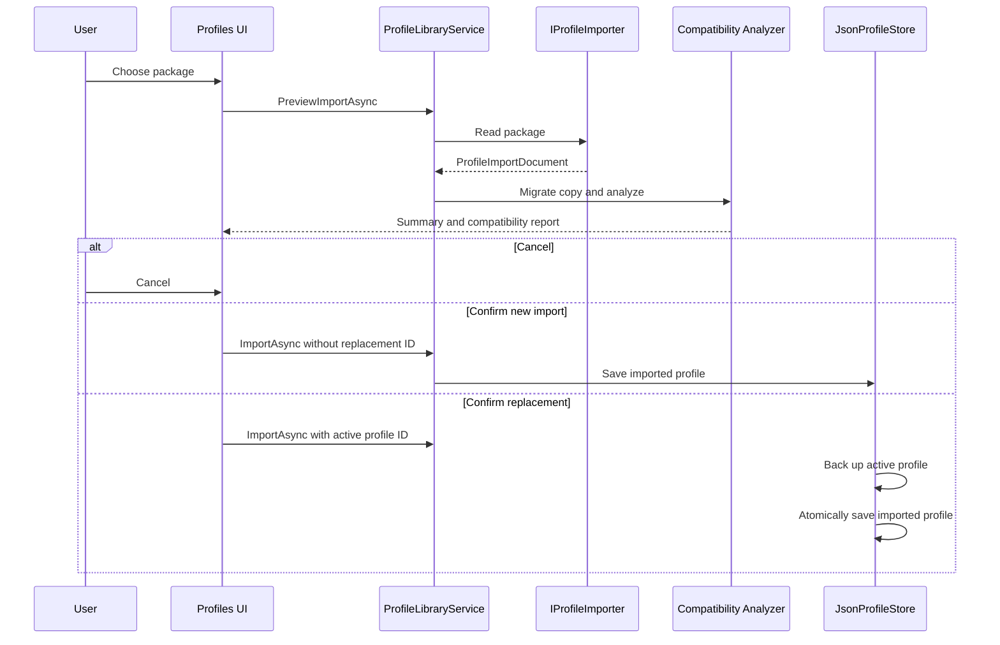

# Profile Import And Export

## Import Flow

Preview displays package/profile metadata, device/mapping/transform counts, output plugins, source/current schemas, and every compatibility issue with a suggested fix. Preview does not write profiles or backups.

## Compatibility Rules

| Result | Meaning | Import allowed |
| --- | --- | --- |
| Compatible | No warnings or errors | Yes |
| Partially Compatible | Missing devices, unknown transforms, conversion warnings, or another recoverable mismatch | Yes |
| Not Compatible | Newer unsupported schema, missing required output plugin, or critical invalid configuration | No |

The analyzer checks schema version, loaded output plugins, connected device identities, known transform types, importer conversion warnings, and profile validation errors. It never removes unsupported configuration.

## Extension Contracts

`IProfileImporter` declares an ID, display name, supported extensions, a capability check, and asynchronous read operation. It returns a `ProfileImportDocument` containing package kind, source schema, converted profile, non-destructive conversion warnings, optional package security evidence, and optional bounded screenshot content.

`IProfileExporter` declares supported package kinds and writes a `ProfileExportRequest`. The request can carry selected mapping IDs, device-group IDs, an exporter ID, or a screenshot path without coupling the exporter to WPF selection state.

`IProfileLibraryService` selects providers, runs migration/compatibility preview, confirms persistence through `IProfileStore`, exports packages, and performs library search.

## Current JSON Provider

`JsonProfilePackageImporter` supports:

- existing raw HOTASBridge `.json` profiles;
- versioned `.hotasprofile` package envelopes;
- versioned `.hotastemplate` package envelopes.

`JsonProfilePackageExporter` preserves raw full-profile JSON compatibility and writes package envelope version 1 for templates and selected content. Files are human-readable UTF-8 JSON.

## Signed Bundle Provider

`SignedProfilePackageImporter` and `SignedProfilePackageExporter` support `.hotasbundle` archives. A bundle contains only top-level `manifest.json`, `profile.json`, `signature.json`, and an optional `screenshot.png` or `screenshot.jpg`.

Security and resource rules:

- ECDSA P-256 with SHA-256 signs a domain-separated hash of the exact manifest, profile, and screenshot bytes.
- The signature descriptor carries publisher metadata, the public key, and its SHA-256 fingerprint.
- The local publisher private key is non-exportable and remains in the Windows current-user CNG key store.
- `trusted-publishers.json` is an offline explicit allow-list; the local publisher is trusted automatically.
- A valid unfamiliar publisher produces a warning and remains reviewable.
- A missing or invalid signature blocks import.
- Archives are read in place and never extracted.
- Entry names, entry count, archive size, profile size, screenshot size, image type, dimensions, and pixel count are bounded.
- If CNG is unavailable, startup continues with a clearly logged temporary publisher identity. Its bundles remain cryptographically verifiable but will be unfamiliar after restart.

The Profiles page defaults package export to this signed format. Legacy JSON remains an explicit option.

## Screenshot Assets

A signed bundle may include one PNG or JPEG screenshot. The export UI accepts a local image, the archive records its original file name, media type, width, and height, and import preview displays a decode-limited thumbnail only after the signature is cryptographically valid. Screenshot bytes are package media; they are not embedded in active profile JSON or interpreted by the runtime.

Limits are 5 MiB, 8192 pixels per dimension, and 24 million decoded pixels.

## Thrustmaster T.A.R.G.E.T. Importer

`ThrustmasterTargetScriptImporter` reads local `.tmc` files using the basic `MapKey(&Device, Control, event);` grammar documented by Thrustmaster.

It converts only:

- simple quoted single keys such as `'a'`;
- built-in single-key names present in the HOTASBridge US ANSI key catalog;
- `ENT`/`ENTER`, `SPACE`, `TAB`, `ESC`, and `BACKSPACE` aliases.

Converted mappings target Keyboard Output, remain disabled, retain symbolic device/control names, and require device rematching and user review. DirectX events, axis functions, macros, layers, timing, modifier expressions, `CHAIN`, and other advanced syntax are not guessed; each unsupported `MapKey` statement appears as a line-numbered conversion warning.

## Replacement And Backup

Replacement import preserves the selected active profile ID so references and recent-profile identity remain stable. Before writing, `JsonProfileStore` copies the current stored profile to the Backups directory using a `before-import` UTC timestamp. The source package is never modified.

## Evidence-Gated Future Importers

WinWing SimAppPro, Logitech, Virpil, and VKB exports do not currently have a stable public interchange schema in the project evidence set. Converters remain deferred until an official schema or representative user-approved fixtures can support deterministic tests. A future partial converter must preserve every representable item, attach warnings for unsupported content, and never claim complete conversion.

Online/community/cloud services, arbitrary archive extraction, executable package content, automatic plugin installation, and automatic dependency acquisition are explicitly outside the current implementation.
