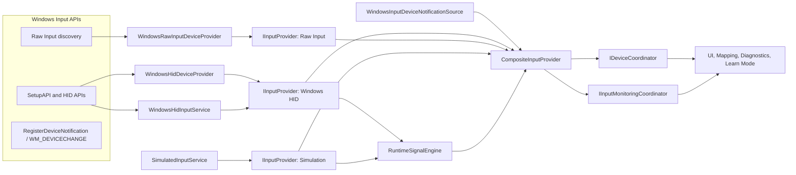
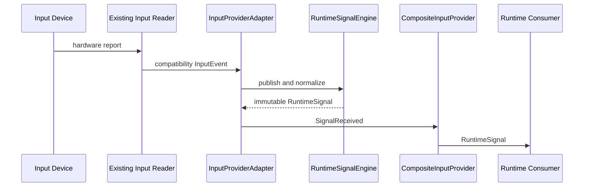

# Input Layer

This document defines the Chapter 4 Input Device Layer for HOTASBridge Version 2.

## Requirement Comparison

| Requirement | Initial State | Chapter 4 Result |
| --- | --- | --- |
| Discover devices | Implemented | Existing HID, Raw Input, virtual HID, and simulation discovery preserved behind providers. |
| Read controls | Implemented | Existing HID background readers and simulation source preserved. |
| Enumerate controls beyond legacy limits | Implemented | HID capability enumeration and simulated devices continue without a 32-button assumption. |
| Common provider interface | Partial | Added signal-native `IInputProvider` for initialization, enumeration, start/stop, signals, errors, lifecycle, status, and disposal. |
| Publish RuntimeSignals | Partial | `InputProviderAdapter` converts legacy `InputEvent` values at the provider boundary; the app receives only RuntimeSignals. |
| Automatic hot-plug/removal | Missing | Native Windows HID notifications wake `CompositeInputProvider`; it publishes connected/disconnected/reconnected events and retains safety/degraded polling. |
| Device health | Missing | Added Connected, Active, Idle, Error, Unsupported, Disabled, and Disconnected states. |
| Stable identity strategy | Partial | Added GUID/container identity fields and explicit matching priority while preserving existing stable IDs/profile compatibility. Windows HID now retrieves validated SetupAPI Container IDs and reconciliation backfills profiles additively. |
| Multiple simultaneous devices | Implemented | Existing profile groups and mapping behavior preserved. |
| Input Learn Mode | Partial | Added selected-device/group scope, baseline noise rejection, first-input capture, highlighting, details, confirm, retry, and capture without Xbox output. |
| DirectInput provider | Missing | Deferred; there is no current implementation or approved dependency. The provider contract can accept it without app changes. |

## Provider Architecture

The composition root is the only application code that constructs concrete providers. `MainViewModel` depends on `IInputProvider` for provider events and cached signals, on `IDeviceCoordinator` for discovery/profile membership, and on `IInputMonitoringCoordinator` for selected-device monitoring lifecycle.

`DeviceCoordinator` serializes discovery, applies demo-device visibility, reconciles reconnect identities, and owns stable-ID profile membership mutations. It never constructs WPF view models or starts outputs.

`WindowsInputDeviceNotificationSource` owns the Win32 message-only window and HID interface registration inside the Input project. `CompositeInputProvider` coalesces native bursts for 150 ms, then runs the same serialized provider enumeration and lifecycle comparison used by manual refresh. Native mode retains a 30-second safety poll; failed or unavailable registration automatically uses the existing two-second poll.

`InputMonitoringCoordinator` owns input-only start/stop, cancellation, equivalent-selection deduplication, and watchdog restart. It does not start output plugins, so device inspection, Learn Mode, mapping preparation, and curve editing remain available while generated output is stopped.

## Provider Contract

Every provider exposes:

- stable provider ID and display name;
- declared discovery/live-input/control/source capabilities;
- current provider status;
- read-only Runtime Signal Cache;
- signal, device lifecycle, and provider error events;
- initialize, enumerate, start, stop, and asynchronous disposal operations.

`InputProviderAdapter` preserves the provider-specific `IInputDeviceCatalog` and `IInputEventSource` implementations internally. Compatibility `InputEvent` objects do not leave the adapter. The unused pre-provider `CompositeInputCatalog` and `CompositeInputEventSource` aggregates were retired; `CompositeInputProvider` is the only application-facing aggregate.

## Current Providers

| Provider | Discovery | Live Input | Control Enumeration | Notes |
| --- | --- | --- | --- | --- |
| Windows HID | Yes | Yes | Yes | Primary physical/virtual HOTAS provider using the existing native implementation. |
| Raw Input | Yes | No | Generic discovery controls | Discovery-only corroboration; duplicate paths are merged in favor of HID. |
| Simulation | Yes | Yes | Yes | Development/demo physical and virtual devices. Hidden unless demo devices are enabled. |
| PlayStation touch | Through Windows HID | Yes | Yes | Additive DS4/DualSense USB/Bluetooth raw-report parser; standard controls retain the generic HID path. |
| Virtual HID devices | Yes | Yes | Yes | vJoy and similar installed devices flow through Windows HID and are classified virtual. |
| DirectInput | Deferred | Deferred | Deferred | Provider slot exists; no current backend/library is present. |

Future Bluetooth, network, serial, CAN, Arduino, and replay providers implement the same interface.

## Signal Publication

Providers never run mappings or generate output. Minimal validation, timestamps, range normalization, quality flags, and diagnostics occur before publication. Deadzones, curves, filtering, and scaling remain Transform Engine responsibilities.

Windows HID discovery and live report processing share `HidValueParsing`. The shared boundary preserves the native 72-byte `HIDP_VALUE_CAPS` layout, limits malformed or oversized usage ranges to at most 64 controls, sign-extends 8/12/16/32-bit values from the report bit width, clamps axis values to declared logical ranges, and leaves hat null values unclamped for `HatNormalizer`. Bipolar axes scale negative and positive sides independently so both declared endpoints normalize exactly.

## Device Health

The composite manager derives health from discovery, provider status, and recent signals:

- Connected: discovered but no live sample has been observed.
- Active: a sample was observed within two seconds.
- Idle: samples exist but the latest is older than two seconds.
- Error: the owning provider reports an error.
- Disconnected: emitted with removal lifecycle events.
- Unsupported and Disabled: available for provider/configuration decisions.

Provider and device counts, active/idle counts, enumerated controls, and provider statuses are published through `IRuntimeTelemetry`.

## PlayStation Touchpad Extension

Sony VID `054C` devices with supported DualShock 4 (`05C4`, `09CC`, `0BA0`) or DualSense (`0CE6`, `0DF2`) product IDs receive a stable named control catalog during ordinary HID discovery. Existing `axis-*`, `hat-1`, and `button-*` IDs and profile identity remain compatible, while descriptor-estimated phantom buttons are excluded.

The touch reader consumes the same input report already read by `WindowsHidInputService`. Model-specific parsers select the USB or Bluetooth layout by report ID and length. DS4 packed historical samples are processed in order; DualSense publishes its current two-contact sample. Both decode the controller's inactive flag, seven-bit contact ID, and packed 12-bit X/Y coordinates.

Bluetooth DS4 controllers initially publish a minimal `01` report without touch coordinates. If the persisted PlayStation touchpad switch is enabled, the HID reader requests full reports with Sony's standard CRC-protected output packet. Disabling the switch bypasses activation and touch parsing while ordinary HID controls continue normally.

The HID reader reuses its report, usage, and button-state buffers. High report rates do not create per-packet report arrays or button collections.
Once a controller switches to a full touch-capable packet, a model-specific raw adapter publishes the normal sticks, analog and digital triggers, D-pad, face buttons, shoulders, Share/Create, Options, stick clicks, PlayStation button, touchpad click, and DualSense microphone button. Compact reports continue through the generic Windows HID decoder.

Each controller publishes:

- `Touchpad Click`, exclusive Single-Finger Contact, and Two-Finger Contact buttons;
- contact ID and absolute X/Y diagnostics for each physical contact;
- single-finger pointer X/Y, two-finger centroid X/Y, and pinch-distance deltas;
- explicit zero movement and inactive events when a finger lifts;
- model, transport, report counter, and contact ID in signal diagnostic metadata.

Only semantic gesture controls and click are offered as normal mapping choices. Raw positions, second-contact movement, and contact IDs remain diagnostic controls. A two-contact sample suppresses single-finger motion so future scrolling and zoom mappings do not also move the pointer.

The controls become ordinary cached RuntimeSignals. Device Inspector, Learn Mode, Mapping Editor, profiles, recording, and diagnostics consume them through existing interfaces. No touch parser calls the mouse, keyboard, Xbox, macro, or mapping subsystems directly.

See [PLAYSTATION_TOUCHPAD.md](PLAYSTATION_TOUCHPAD.md) for mapping behavior and current gesture boundaries.

## Input Learn Mode

Learn Mode uses `InputLearnSession`:

1. Scope to the selected Mapping Editor device, or the selected profile group if no single device is selected.
2. Snapshot current cached values as the baseline.
3. Ignore analog movement below the configurable 0.18 threshold.
4. Ignore signals outside the scope and invalid signals.
5. Stop on the first meaningful input.
6. Highlight the device/control in Mapping Editor and Device Inspector.
7. Display device, control, ID, raw value, and normalized value.
8. Confirm to create the mapping, Retry to establish a new baseline, or Cancel.

If mapping is stopped, Learn Mode starts only the selected input providers. It does not connect or update the Xbox output.

## Error And Resource Rules

- Provider failures are logged and published as structured error events.
- A failing provider does not prevent other providers from enumerating or reading.
- HID readers retain their existing cancellation and handle-disposal behavior.
- Provider shutdown occurs in reverse order.
- Monitoring and input capture use cancellation tokens and no UI-thread blocking calls.
- The native notification window runs on one background message thread and is stopped before provider disposal.
- The app keeps the existing ViGEm output path completely outside this layer.

## Deferred Work

- DirectInput backend selection and compatibility testing.
- Native suspend/resume events; the event contract already represents them.

## Easy Input and Hat Milestone

The Windows HID provider now attaches a `HatDescriptor` to every enumerated hat. The descriptor carries provider ID, encoding, logical range, null state, direction count, and optional center-button capability. Live reports produce a `HatState` containing the preserved raw value and one normalized direction. Repeated identical directions are not republished; one centered event is published when the control returns to idle.

Supported normalization contracts are:

- DirectInput hundredths (`-1`/unsigned max centered, 0 through 31500 directions);
- HID zero-based directions with a provider-declared null;
- HID one-based directions with zero center;
- individual direction buttons, including combined diagonals;
- simulated zero-based hats;
- provider-specific metadata through the extensible descriptor.

A provider-less legacy conversion remains only for old tests/compatibility. New live providers must describe their encoding rather than rely on one global numeric interpretation.

### Provider Correlation

`CompositeInputProvider` groups only strong same-interface representations. It prefers a provider that supplies both live input and control enumeration, exposes a user-facing warning listing correlated providers, logs/telemeters the correlation once, and keeps the preferred identity stable. Distinct processed virtual paths such as vJoy are not merged into a physical controller.

The `AllowDuplicateInputProviders` Advanced setting includes correlated representations with distinct stable IDs after restart. This is diagnostic control, not the normal path.

### Monitoring Without Outputs

Physical provider initialization and Runtime Signal Cache updates do not depend on mapping/output activation. Device Inspector, Learn Input, and curve testing can therefore run while the virtual Xbox controller and SendInput outputs remain stopped. Start Mapping activates the mapping/output lifecycle only.

## Head-Tracking Provider Extension

Head tracking is a separate signal source because camera/pose protocols are not Windows HID controls. The Input project owns provider implementations behind Core's `IHeadTrackingProvider`; providers publish immutable `HeadPose` samples and never map or inject output.

The first transport implementation is OpenTrack-compatible UDP:

- loopback-only listener with configurable port 1024-65535;
- six little-endian doubles in OpenTrack order X, Y, Z, Yaw, Pitch, Roll;
- malformed/non-finite packet rejection;
- 300 ms stale-source detection;
- cancellation and socket disposal through the provider lifecycle;
- distinct OpenTrack UDP and LookPilot provider identities over the shared transport.

The second transport is FreeTrack shared memory:

- standard `FT_SharedMem` mapping and `FT_Mutext` synchronization object;
- changed-frame detection through `DataID` at a 4 ms polling interval;
- protocol conversion from radians/millimeters to `HeadPose` degrees/centimeters;
- 300 ms stale-source detection and clean provider cancellation.

The third transport is the NaturalPoint TrackIR client interface:

- dynamically loads the user-installed `NPClient64.dll`/`NPClient.dll` from NaturalPoint's current-user registry location;
- validates the official client signatures and registers the application window plus public SDK profile ID `1000`;
- requests all six pose fields and polls every 8 ms without involving WPF;
- converts packed TrackIR frames into immutable `HeadPose` values;
- detects unchanged/stale frames, mouse-emulation conflicts, read failures, and clean cancellation.

`HeadTrackingProviderCatalog` exposes OpenTrack UDP, LookPilot opentrack UDP, LookPilot FreeTrack, and TrackIR as available. Each retains a distinct provider identity and setup guidance while publishing the same immutable `HeadPose` contract. Tobii, Webcam AI, and OpenXR remain planned. A future provider supplies the same pose contract and does not require changes to mapping, WPF, or mouse output.

The Head Tracking page's Learn command consumes the existing RuntimeSignal stream only for application-action activation. It listens to enabled selected-profile devices, accepts buttons/switches on a rising edge, and does not add head poses to the hardware mapping path.
