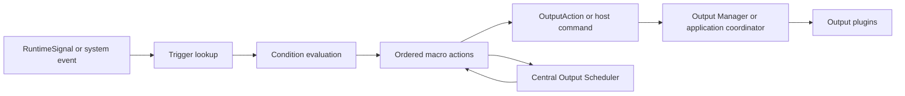

# Macro Engine

## Status

The Macro Engine and Visual Macro Editor are enabled Beta features behind the `macro-engine` feature flag. They are optional and do not replace ordinary mappings. Profiles without macros follow the existing input, mapping, transform, and output paths unchanged.

The engine is implemented in `HOTASBridge.Core` and depends only on published runtime, scheduler, output-action, telemetry, and logging contracts. It has no WPF, hardware, ViGEm, or Windows API dependency.

## Runtime Flow

`MacroEngine` never communicates with input hardware or output plugins. `IMacroRuntimeSink` is the application boundary: output actions enter the bounded Output Actions runtime queue, while mapping/profile/notification commands return to the application coordinator.

## Visual Authoring

Easy and Advanced Macro Editor surfaces modify the active profile's existing `MacroDefinition` and `MacroVariableDefinition` objects. Neither owns or translates a second macro model. Device, control, mapping, profile, Xbox, keyboard, and mouse choices use friendly selectors while stable IDs remain in the profile.

New macros are created disabled with a valid Profile Loaded trigger and notification action. Valid edits refresh the configured runtime through a short debounce; invalid definitions remain editable and visible but cannot execute. Save Profile persists the changes through the existing profile service.

Easy mode owns no runtime logic. Recording compiles timestamped physical keyboard/mouse input into ordinary bounded action definitions. Single-macro package transfer uses `IMacroTransferService`, independent of WPF dialogs.

Advanced mode exposes conditions, runtime variables, complex triggers, host commands, and safeguards over those same definitions.

## Lifecycle

1. The active profile is migrated and validated.
2. Macro definitions and variable definitions are configured.
3. Mapping start activates the macro context and schedules timer triggers.
4. RuntimeSignals and supported system events are offered to the engine.
5. Matching macros execute ordered actions until completion, pause, wait, cancellation, or failure.
6. Mapping stop, profile replacement, emergency reset, suspend, or shutdown cancels scheduled work and releases held outputs.

Configuration may be loaded while mapping is stopped so diagnostics can display it. Inactive runtime contexts cannot execute timers, signals, debugger restarts, or debugger steps.

## Trigger Model

Current triggers are button press/release, axis threshold, axis zone entry/exit, encoder rotation, switch position, timer, profile loaded, device connected, and device disconnected.

Control triggers match stable device and control IDs. Threshold and zone triggers compare the current immutable RuntimeSignal with its previous value, so a held signal does not repeatedly retrigger an edge event.

Timer triggers use `IOutputScheduler`. No macro owns a timer loop or thread.

## Conditions

All configured conditions must pass before a macro starts. Supported conditions are active profile, active layer, runtime variable value, device connected, mapping toggle/activity state, time since last activation, another macro running, and output plugin available.

Conditions consume a `MacroExecutionContext` snapshot. They do not query hardware or WPF controls.

## Actions

Supported actions are:

- press/release/toggle Xbox buttons and set Xbox axes;
- press/release/toggle keyboard keys;
- press/release/toggle mouse buttons, replay bounded relative mouse movement, and scroll either wheel axis;
- delay, wait, and conditional delay;
- set or toggle a runtime variable;
- enable or disable a mapping;
- activate a profile;
- show an application notification.

Output actions use the same `OutputAction` model and Output Manager path as mappings. Mapping and profile commands rebuild existing runtime configuration through application-owned methods.

## Repeat And State

Playback modes are Timeline, Sequence, and Ping-pong. Sequence and Ping-pong select one of at most five action groups for each trigger activation. Their cursor and direction reset when the profile is configured and are never persisted.

Repeat modes are Once, Count, Until Released, Until Condition, and Infinite, and apply inside the action group chosen for that activation. Runtime state tracks current action, iteration, trigger source/count, wait deadline, pause state, execution duration, error, and active outputs.

Unbounded modes require an unconditional yield of at least 10 ms and have a configurable maximum-iteration safeguard. Runtime state is never serialized into profiles.

## Scheduling And Safety

- Delays and timers share the centralized output scheduler under owner `macro-engine`.
- Macros create no threads and perform no blocking waits.
- Only one active instance of a macro definition is allowed at a time.
- Stop and failure cancel the continuation and release held buttons/keys or reset active axes.
- Stop All also cancels timer triggers.
- Invalid definitions are diagnosed and left inactive.
- One failed macro does not stop mapping or another macro.
- Safe Mode continues to prevent output plugins from producing OS input.

## Diagnostics

The engine publishes shared telemetry for configured, running, and waiting counts; trigger counts; runtime-variable counts; action-stage metadata; execution duration; status; and errors.

`GetSnapshot()` returns immutable debugger data. The Macro Debugger consumes only `IMacroEngine` snapshots and commands. Macro action stages carry source device/control identity so the Signal Flow Inspector can display macro execution in the selected control pipeline.

## Extensibility

New triggers, conditions, and actions extend domain enums, validation, and the corresponding evaluation boundary. Future voice/SimConnect triggers, random delays, sound, and shared macro-library workflows remain deferred. Network trigger work remains shelved. These additions must continue using RuntimeSignals, OutputActions, host commands, and the centralized scheduler.
