# Mapping Engine

Chapter 7 changes the live mapping boundary from direct Xbox-state mutation to standardized output actions while preserving the existing HOTAS behavior.

## Runtime Flow

```mermaid
flowchart LR
    Signal["RuntimeSignal"] --> Lookup["Indexed mapping lookup"]
    Lookup --> Conditions["Layer and condition evaluation"]
    Conditions --> Transforms["Ordered transform chain"]
    Transforms --> State["Runtime mapping state"]
    State --> Actions["OutputAction batch"]
    Actions --> Conflicts["Conflict resolution"]
    Conflicts --> Manager["Output Manager"]
    Manager --> Backend["Output backend"]
```

The engine has no Windows, ViGEm, keyboard, or hardware dependency.

Schema-v9 mappings may additionally contain an enabled graph. UpdateMappings validates and compiles each graph once into a bounded topological plan. Graph nodes process RuntimeSignals, then the result enters the same compatibility and Output Mapping stages shown above. Graph-free mappings retain the existing ordered pipeline.

## Mapping Configuration

Schema v3 mappings contain:

- stable mapping ID and name;
- source device, control, and input type;
- enabled state and shift layer;
- ordered transform descriptors;
- output plugin, generic control ID, kind, and plugin configuration;
- priority and notes;
- optional conditions;
- a separate mapping function and behavior;
- split-axis side selection where applicable;
- legacy Xbox enum and axis/button settings retained for compatibility.

Runtime values, toggles, pulses, active contributions, and timestamps are not serialized.

## Authoring Transactions

`MappingProfileEditor` is the UI-independent mutation boundary for normal Mapping Editor operations. A `MappingAuthoringRequest` snapshots the selected input, mapping function, behavior, optional split side, output family, hat behavior, axis settings, pointer settings, keyboard metadata, and optional Analog PWM options. Add, update, and remove operations enable required profile outputs and synchronize compatibility descriptors as one transaction.

Mapping functions describe conversion (`AxisToTrigger`, `SplitAxis`, threshold region, direction detection, or hat/encoder routing). Behaviors describe how the converted value acts (`Direct`, `Inverted`, `Momentary`, `Toggle`, `Pulse`, and related timing modes). Axis inversion is generated before split-axis conversion so the physical center remains zero in both directions.

Validation occurs before mutation. Invalid targets or PWM settings do not partially modify an existing mapping. Updates preserve mapping identity, name, conditions, notes, priority, layer/enabled state, and non-PWM custom transforms while replacing the selected source/output configuration and detached mutable processing settings.

## Lookup And Live Editing

`IMappingEngine.UpdateMappings` builds an immutable snapshot indexed by case-insensitive device/control key. Processing looks up only mappings affected by the incoming signal. Rebuilding swaps the snapshot atomically; the app does this whenever mappings are created, edited, duplicated, enabled, disabled, loaded, or switched with a profile.

Invalid mappings remain unchanged in the profile but are excluded from the active lookup. Removed, disabled, invalid, or retargeted mappings generate release/neutral transition actions for any live contribution.

## Mapping Editor Preview

`MappingOutputPreviewSession` owns a separate Mapping Engine instance, runtime state store, held-control set, and visual output reducers. While mapping output is stopped, the Mapping Editor evaluates the input monitor's throttled `RuntimeSignal` stream through this isolated session and renders the resulting Xbox, keyboard, and mouse state without dispatching any `OutputAction` to the Output Manager.

Opening the Mapping Editor replays the latest Runtime Signal Cache snapshot so current physical positions are visible before new movement. Profile edits rebuild and reset the preview session. Starting mapping switches the editor to actual output-plugin diagnostics; stopping mapping reconstructs preview state from the cache.

Preview state never enters the live Mapping Engine, output scheduler, output plugins, virtual-controller driver, Dashboard, or Output Monitor. This prevents preview toggles, pulses, held keys, and transform state from affecting the next live runtime session.
Right-clicking anywhere on an analog control card in the Mapping Editor opens a focused modal Curve Editor for that device/control pair. It uses a detached settings copy until **Save curve** writes through `AxisCurveProfileEditor`, synchronizes matching mappings, and marks the input card with an `S` badge. The modal omits device/axis switching but preserves inversion, one shared curve type, linked or independent negative/positive numeric settings, exact deadzones/exponents/S-curve strengths/sensitivity, draggable custom points, reset, and live raw/processed values. Closing without saving leaves the profile unchanged.

## Conditions

Supported condition types:

| Condition | Operand |
| --- | --- |
| Profile Active | Profile ID or name |
| Layer Active | Shift layer ID |
| Shift Control Held | Control ID or `deviceId|controlId` |
| Device Connected | Stable device ID |
| Toggle Enabled | Mapping ID; blank fallback is not accepted by validation |

All conditions on a mapping must match their expected state. The application supplies active profile, active held layer, connected devices, and currently held discrete controls through `MappingExecutionContext`.

## Transform Chain

Known enabled descriptors execute directly in the order stored by each mapping. Schema-v8 and schema-v9 persisted mappings end with one enabled generated behavior descriptor:

- normalization, calibration, deadzone, anti-deadzone, filter, curve, scaling, inversion, and clamp for generated axis processing;
- optional specialized descriptors such as axis split, threshold, Analog PWM, and direction detection;
- behavior, toggle, or pulse as the mapping-owned final behavior stage.

The executed behavior descriptor publishes effective mode and timing as immutable RuntimeSignal metadata. Output mapping and output-action generation consume that metadata instead of rereading legacy behavior fields. Descriptor-free in-memory mappings retain the exact legacy path as a compatibility fallback.

Unknown future descriptors are preserved in profiles and skipped with diagnostics until a matching runtime transform is registered. Normal profile saves preserve descriptor settings and order. Mapping Editor updates refresh generated descriptors for the edited mapping; Axis Curves updates only generated axis-processing descriptors.

## Output Actions

The engine emits immutable `OutputAction` records:

| Action | Current producer |
| --- | --- |
| Set Xbox Axis | Axis to Xbox axis |
| Press/Release Xbox Button | Axis/button/hat/encoder/switch to Xbox button or D-pad |
| Press/Release Keyboard Key | Keyboard-target mapping |
| Start/Stop PWM | PWM keyboard-target mapping |
| Move Mouse | Scheduled hat/axis movement or immediate profile-configured relative touch movement |
| Press/Release Mouse Button | Mouse-target digital mapping, including PlayStation touchpad click |
| Set Plugin Value | Generic future plugin target |

Each action carries mapping identity, plugin/control target, value, priority, source order, timestamp, active-contribution state, and output configuration.

The Output Manager dispatches Xbox actions to the preserved ViGEm plugin and keyboard/PWM actions to the Windows SendInput plugin. Unknown generic plugin actions remain diagnosed until a matching plugin is registered.

### PlayStation Touchpad Preset

The Easy Mode Touchpad preset creates three normal profile mappings: first-finger Move X, first-finger Move Y, and physical touchpad click. The two axes target Mouse Horizontal/Vertical with persisted `mouseMovementMode=relative`; click targets Left Mouse Button. Relative deltas still pass through lookup, validation, the transform pipeline, conflict handling, OutputAction creation, and Output Manager dispatch.

Touch delta calibration is fixed to the parser's bounded `-128..128` report-to-report range so one decoded touch pixel remains one relative mouse unit by default. The mouse plugin performs no continuing movement after the event, and finger lift publishes a neutral value. This mode does not alter scheduled HOTAS-axis or hat mouse behavior.

## Priority And Conflict Rules

Conflict mode is stored on the profile:

- `FirstWins`: earliest configured active contribution wins.
- `LastWins`: latest configured active contribution wins.
- `HighestPriority`: highest numeric priority wins; configured order is the deterministic tie-breaker.

Contributions persist across separate input events. When a winner releases, becomes invalid, is disabled, changes layer, fails a condition, is removed, or changes target, the engine restores the next eligible contribution or emits a release/neutral action. Profile order is never modified.

## Validation

Runtime activation rejects mappings with:

- missing or duplicate mapping identity;
- missing source device/control IDs;
- missing output plugin/control IDs;
- empty transform types;
- invalid conditions.

Profile Health additionally checks connected devices, plugin availability, axis ranges, duplicates, and output conflicts. Invalid mappings do not stop the engine.

## Signal-Native Boundary

`IMappingEngine` exposes one execution path: `ProcessSignal(RuntimeSignal) -> MappingExecutionResult`. The application and regression suites consume immutable `OutputAction` batches. `XboxOutputActionReducer` remains an Xbox backend state adapter and is not part of mapping evaluation.

## Performance And Diagnostics

- Device/control lookup avoids scanning unrelated mappings.
- Mapping snapshots are swapped atomically for live edits.
- Runtime state and contributions are keyed by mapping ID.
- Action batches allocate only for affected mappings and transition targets.
- Telemetry reports affected/matched mappings, action count, duration, and mapping/output stage diagnostics.
