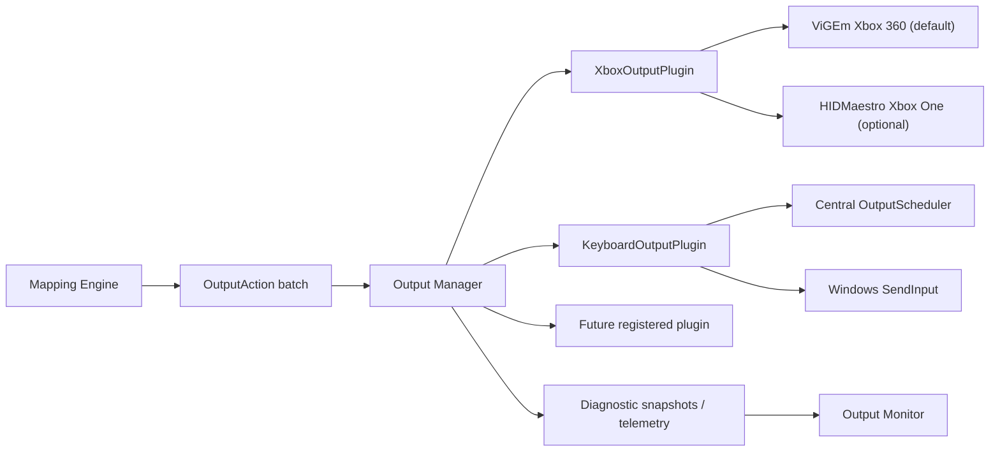
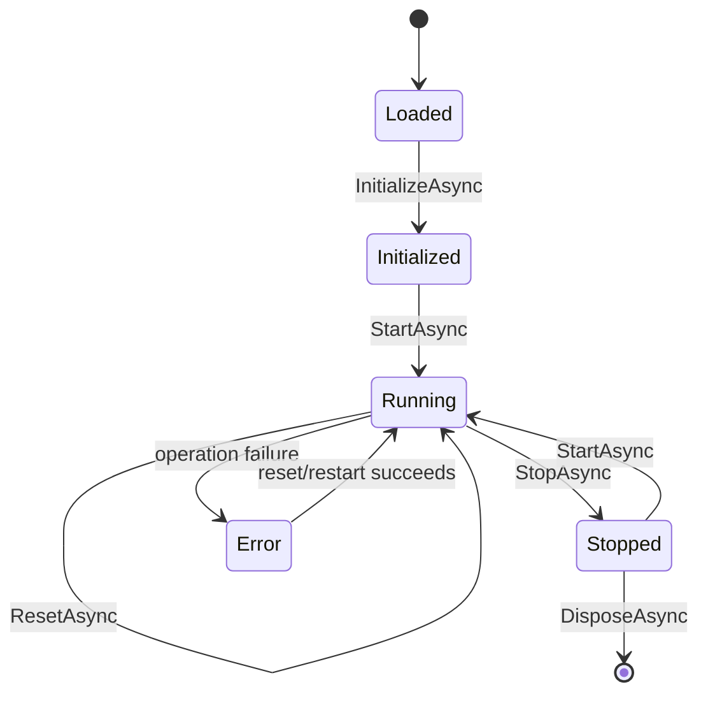
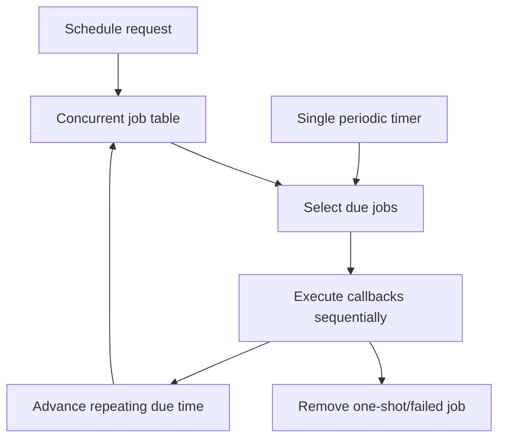

# Output System

## Requirement Comparison

| Requirement | Result |
| --- | --- |
| Independent output plugins | Complete foundation. `IOutputPlugin` defines common lifecycle, batch action processing, reset, diagnostics, and disposal. |
| Output Manager lifecycle ownership | Complete. Manager initializes, starts, dispatches, resets, stops, monitors, and disposes every registered plugin. |
| Existing Xbox output preserved | Complete. ViGEm implementation remains the stable default behind `XboxOutputPlugin`; native driver/client code was not replaced. |
| Optional Xbox-family output | Beta. HIDMaestro is feature-gated, explicitly installed, independently diagnosed, and selected per profile without rewriting existing Xbox mappings. |
| Keyboard SendInput output | Complete. Captured scan codes, injected-event filtering, combinations, repeat, and mapping-owned bipolar PWM are supported. |
| Central scheduler | Complete. One cooperative timer loop owns all delayed, repeating, and PWM jobs. |
| Runtime-only output state | Complete. Xbox, held keys, active PWM/repeat jobs, rates, and errors are never serialized. |
| Reset and clean shutdown | Complete. Every plugin cancels jobs and releases/neutralizes owned output. |
| Failure isolation | Complete. One plugin failure is diagnosed, reset, and contained while other plugins continue. |
| Output Monitor | Complete. UI consumes only `IOutputManager` diagnostic snapshots. |
| Plugin SDK/discovery | Complete foundation. Internal runtimes publish manifests; startup discovers and validates external metadata without executing DLLs. |

## Runtime Architecture

The Mapping Engine has no plugin, ViGEm, SendInput, or Windows dependency. It emits standardized `OutputAction` values. The Output Manager groups actions by `PluginId` and dispatches only to the matching plugin.

## Plugin Lifecycle

`OutputManager.ConnectAsync` starts the scheduler, initializes each plugin once, and starts each plugin independently. `DisconnectAsync` stops plugins in reverse registration order and stops the scheduler. Lazy connect remains for compatibility when an action batch arrives before an explicit start.

Before a runtime session starts, the active profile's output configuration is applied through `IOutputManager.ConfigurePlugin` and `IOutputManager.ConfigureEnabledPlugins`. Generic setting definitions let Output Monitor edit supported values without referencing HIDMaestro classes directly. Explicitly disabled plugins remain loaded for diagnostics but are not initialized, started, reset, restarted, or sent actions; disabling Xbox therefore prevents virtual-controller creation while keyboard and mouse can continue independently.

## Dispatch And Isolation

1. Actions are grouped by case-insensitive plugin ID. Logical `xbox360` actions are rewritten only at this boundary when the profile selects the Xbox-family backend.
2. Each selected plugin receives one batch, preserving the existing single Xbox update per mapping batch.
3. Unknown plugin IDs are logged once per action type and do not affect loaded plugins.
4. Plugin exceptions are caught at the manager boundary, recorded in diagnostics, and followed by an isolated reset attempt.
5. Dispatch proceeds to the remaining plugin groups.

Cancellation requested by the application is not treated as plugin failure and propagates normally.

## Scheduler Architecture

`OutputScheduler` owns one `PeriodicTimer` loop. Jobs are keyed by stable schedule ID and carry plugin ID, due time, optional repeat interval, callback, and description.

The scheduler supports timed release, keyboard repeat, analog PWM, delayed actions, and future macros without one thread per mapping. Telemetry exposes queue depth and last scheduler latency. Slow future callbacks must move work outside the scheduler; current callbacks are short SendInput state changes.

## Reset Rules

Reset is called during shutdown, mapping stop, profile change, explicit monitor reset, output restart, and plugin failure recovery.

- Xbox: cancel plugin jobs, submit neutral state, release all virtual buttons/axes/triggers.
- Keyboard: cancel plugin jobs, release every reference-counted key, clear PWM/repeat/target state.
- Manager: call every plugin independently so one reset failure cannot block others.

Runtime state remains in plugin instances and scheduler jobs. No current value, held key, timer, rate, error, or connection state is persisted to profiles.

## Health And Diagnostics

Health values are `Running`, `Stopped`, `Error`, `Disabled`, `DriverMissing`, and `Unsupported`. Every diagnostic snapshot contains plugin identity/name, health/status, initialization timestamp/duration, output rate, last output timestamp, queue depth, bounded runtime errors, and optional typed Xbox/keyboard state.

Xbox diagnostics additionally carry cumulative ViGEm backend connection, report-submission, and cleanup failure counters plus the last failed operation, timestamp, and message. A recovered backend remains visibly `Warning` when historical failures exist; this evidence is runtime-only and resets when the application process restarts.

The Output Monitor and telemetry consume `IOutputManager.GetPluginDiagnostics`; neither accesses concrete plugins.

## Existing Xbox Stack

The working implementation is preserved exactly behind adapters:

- driver: bundled official ViGEmBus `1.22.0` installer;
- client library: `Nefarius.ViGEm.Client` `1.21.256`;
- native wrapper: `VirtualXboxOutputService`;
- output-plugin adapter: `XboxOutputPlugin`;
- SDK metadata/lifecycle: shared `PluginCatalog` through `IPluginCatalog`;
- compatibility state: `XboxState` and `XboxOutputActionReducer`.

Debug/Release builds and existing neutralization/single-batch update tests continue to pass. See `docs/VIRTUAL-XBOX-OUTPUT.md`.

## Deferred

- External plugin assembly loading, SDK packaging, signature enforcement, permissions, and sandboxing.
- DirectInput, vJoy, MIDI, and OSC plugins. Network output is outside the current local product scope.

## vJoy Decision

HOTASBridge discovers an already installed vJoy device as a virtual input, but the current release does not create vJoy outputs or install the vJoy driver.

The original vJoy repository documents support only through Windows 10 1803 and redirects newer Windows users to forks. The commonly referenced `jshafer817/vJoy` release describes its driver as attestation-signed for Windows 10 and describes Windows 11 operation only anecdotally. That is not a sufficient maintenance and compatibility contract for silently adding a second kernel-driver dependency.

A future vJoy output must therefore:

- begin with an explicit user requirement that Xbox, keyboard, and mouse outputs cannot satisfy;
- select a maintained, signed upstream package and record its license and provenance;
- implement an independent `IOutputPlugin` over `OutputAction`;
- install only after explicit user confirmation and never remove a shared driver silently;
- pass the supported-Windows clean-machine, reset, coexistence, upgrade, and uninstall matrix.

See [ADR 0006](adr/0006-defer-vjoy-output-driver.md). ViGEmBus remains the only bundled virtual-controller driver in the current release.

## Mouse Output Plugin

`MouseOutputPlugin` is an internal output plugin alongside Xbox and keyboard. It consumes `MoveMouse`, mouse-button, and wheel OutputActions and is the only component that calls the Windows mouse `SendInput` boundary.

Supported state:

- relative horizontal/vertical/cardinal pointer velocity;
- proportional analog-axis velocity with deadzone;
- left, right, middle, X1, and X2 buttons;
- vertical and horizontal wheel steps/repeat;
- independent horizontal/vertical speed, inversion, optional acceleration, cap, initial delay, and update interval;
- normalized diagonal speed by default;
- slow/fast held-control modifiers.

All active pointer mappings share one scheduler job. Wheel repeats use keyed scheduler jobs; no mapping owns a thread. Reset, profile change, shutdown, plugin recovery, and Emergency Release cancel movement/wheels and release every tracked button.

The Output Manager can run Xbox, keyboard, and mouse concurrently. Failures remain isolated by the existing plugin boundary. Some elevated or protected applications can reject injected keyboard/mouse input; HOTASBridge does not bypass operating-system or anti-cheat protections.

## Head-Tracking Mouse Output

Head tracking offers **Absolute Position**, **Relative Movement**, and **Velocity**. Absolute Position emits normalized `SetMousePointerPosition` actions that map the captured center and equal opposite offsets symmetrically across the foreground monitor. Relative Movement emits only pose-change deltas. Velocity continuously derives `MoveMouseRelative` actions from distance to center and is the only mode that uses the maximum-velocity setting. Activation can additionally emit a one-shot `CenterMousePointer` action. All Windows injection remains inside the Mouse plugin; the head-tracking runtime does not call SendInput, access `MouseOutputPlugin`, or create a second pointer scheduler.

Pose acquisition and diagnostics can run while mapping is stopped, but OutputAction dispatch is enabled only for an active mapping session. Start Mapping enables the gate after Output Manager starts; Stop Mapping closes it before outputs are neutralized.

Enabling profile head tracking activates the mouse plugin through `OutputProfileUsage` even when the profile has no ordinary mouse mapping. Disabling or losing tracking stops new movement immediately. Output Manager reset/shutdown retains authority over injected state and plugin isolation.

Native head-tracking and virtual-joystick output modes remain extension points and are not started by the current UI.
