# PlayStation Touchpad Input

## Scope

HOTASBridge extends its existing PlayStation HID input with an additive touch subsystem. It does not replace controller discovery, Bluetooth support, standard buttons, sticks, triggers, D-pad handling, profiles, or the Mapping Engine.

Implemented now:

- DualShock 4 and DualSense over USB and Bluetooth;
- one- and two-finger contact tracking;
- packed 12-bit absolute X/Y coordinates;
- contact IDs and finger-lift transitions;
- report-to-report relative movement;
- physical touchpad press;
- named standard controller controls decoded from full touch-capable reports;
- mutually exclusive single- and two-finger gesture modes;
- two-finger centroid movement and pinch-distance deltas;
- Easy Mode touchpad-to-mouse mapping.

Deferred user policies:

- tap-to-click;
- two-finger right-click and scrolling;
- four-way/eight-way swipe recognition;
- gesture macros, layers, profile switching, radial menus, and three-finger gestures.

The raw controls and second contact are available now so those policies can be added without changing report parsing or the Mapping Engine.

## Supported Devices And Reports

| Controller | Sony Product IDs | USB | Bluetooth | Touch Size |
| --- | --- | --- | --- | --- |
| DualShock 4 / revisions / adapter | `05C4`, `09CC`, `0BA0` | Report `01`, 64 bytes | Report `11`, 78 bytes | 1920 x 942 |
| DualSense / DualSense Edge | `0CE6`, `0DF2` | Report `01`, 64 bytes | Report `31`, 78 bytes | 1920 x 1080 |

The transport parsers validate report ID and complete transport length before reading. Windows may expose the DS4 Bluetooth minimal `01` report inside a 547-byte maximum HID buffer. HOTASBridge does not treat that padded packet as USB. When touch input is enabled, it sends the standard CRC-protected Bluetooth HID activation report and then consumes full `11` reports. Unknown Sony products and abbreviated reports are ignored rather than guessed.

The **PlayStation touchpad input** switch is stored in application settings and is available under **Settings > Devices**. Turning it off stops touch parsing and mapped touch outputs without disabling the controller's ordinary sticks, triggers, D-pad, or buttons. Any active touch click is explicitly released during the transition.
Full touch-capable Bluetooth packets are not decoded reliably by the generic Windows HID usage APIs. For supported Sony product IDs, HOTASBridge therefore decodes the six standard axes, D-pad, and actual button bit fields at the same input boundary. Stable `axis-1` through `axis-6`, `hat-1`, and `button-1` through `button-14` IDs preserve existing mappings. DualSense additionally exposes `button-15` for Microphone Mute. The device catalog uses these named controls instead of estimating hundreds of buttons from HID data indices.

DS4 may pack several timestamped touch samples into one input report. HOTASBridge processes the declared samples in order, bounded by transport capacity and available report bytes. DualSense contains one current sample with two contacts.

## Published Controls

Stable control IDs are independent of USB/Bluetooth offsets:

| Display Name | Control ID | Runtime Type |
| --- | --- | --- |
| Touchpad Click | `touchpad-click` | Button |
| Touchpad Single-Finger Contact | `touchpad-finger-1-active` | Button |
| Touchpad Two-Finger Contact | `touchpad-two-finger-active` | Button |
| Touchpad Finger 1/2 X/Y | `touchpad-finger-N-x/y` | Axis |
| Touchpad Single-Finger Move X/Y | `touchpad-finger-1-delta-x/y` | Relative Axis |
| Touchpad Two-Finger Move X/Y | `touchpad-two-finger-delta-x/y` | Relative Axis |
| Touchpad Pinch | `touchpad-pinch-delta` | Relative Axis |
| Touchpad Finger 1/2 Contact ID | `touchpad-finger-N-contact-id` | Axis |

Mapping Editor presents click, exclusive contact modes, single-finger movement, two-finger centroid movement, and pinch. Absolute positions, raw second-contact movement, and contact IDs remain visible to Device Inspector, Runtime Signal Cache, recording, and diagnostics, but do not clutter ordinary mapping choices.

Absolute positions and contact IDs use standard bipolar normalized values while preserving hardware values as RuntimeSignal raw values and metadata. Relative movement is bounded to `-1..1` from a `-128..128` pixel working range. A new contact starts with zero movement to prevent cursor jumps; lifting publishes neutral movement and inactive state.

Exactly one semantic contact mode is active: one contact publishes Single-Finger Contact and pointer deltas, while two contacts publish Two-Finger Contact, centroid X/Y deltas, and pinch distance only. Transitioning between modes resets movement baselines, preventing cursor jumps and preventing two-finger gestures from also moving a single-finger mouse mapping.

## Runtime Flow

```mermaid
flowchart LR
    Controller["DualShock 4 or DualSense"] --> HID["WindowsHidInputService"]
    HID --> Parser["Model and transport touch parser"]
    Parser --> Processor["Contact and movement processor"]
    Processor --> Event["InputEvent"]
    Event --> Signal["RuntimeSignal Engine and Cache"]
    Signal --> Mapping["Existing Mapping Engine"]
    Mapping --> Action["OutputAction"]
    Action --> Manager["Output Manager"]
    Manager --> Mouse["Existing Mouse Output plugin"]
```

No touch component injects Windows input directly.

## Easy Mode Setup

1. Add the PlayStation controller to the active profile.
2. Open Mapping Editor and select any control whose name starts with `Touchpad`.
3. Quick Presets automatically selects **PlayStation touchpad**.
4. Choose **Touchpad to mouse pointer** and apply it.
5. Start mapping with Mouse Output enabled.

The preset creates:

- Finger 1 Move X to relative Mouse Horizontal;
- Finger 1 Move Y to relative Mouse Vertical;
- Touchpad Click to Left Mouse Button.

These are normal editable profile mappings. Removing the preset mappings does not disable touch input or modify the controller.

## Diagnostics

Touch signals carry a qualifier containing controller model, transport, report counter, and contact ID. Device Inspector and Runtime Signal Cache receive the same events as mapping and recording consumers. The HID-open log records input/output report lengths, write access, parser availability, and the enabled state. Bluetooth activation success or failure is logged without recording raw HID payloads.

The HID reader reuses one report buffer, one usage buffer, and two button-state sets for its lifetime. Touch support therefore does not allocate report-sized objects for every controller packet.

## Validation

Automated fixtures cover:

- DS4 USB and Bluetooth report layouts;
- DualSense USB and Bluetooth report layouts;
- active/inactive contacts, contact IDs, maximum coordinates, second contact, physical click, and lift;
- Easy Mode mapping creation;
- full-report sticks, triggers, D-pad, and all named ordinary buttons;
- end-to-end touch delta through Mapping Engine and Mouse Output.
- exclusive single/two-finger transitions, centroid motion, and neutral resets;

Physical DualShock 4/DualSense acceptance on Windows remains required before release status can be marked hardware-passed.
