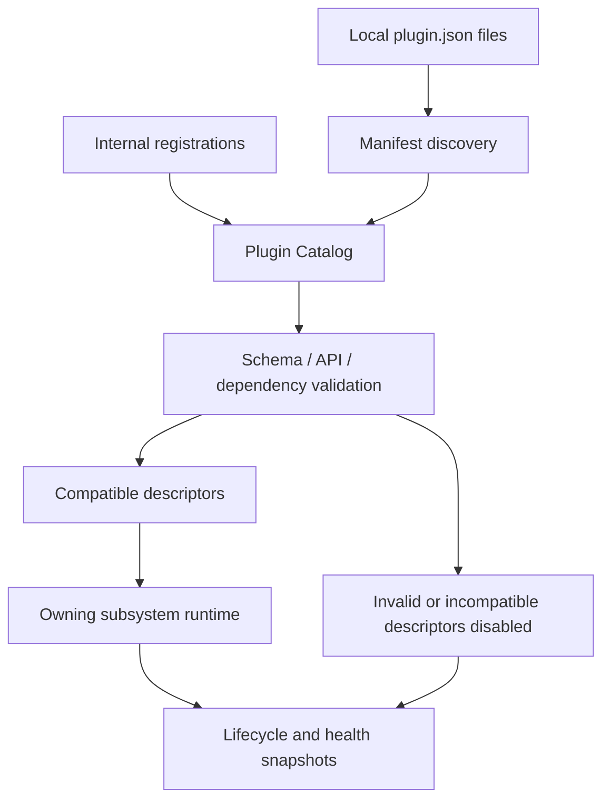
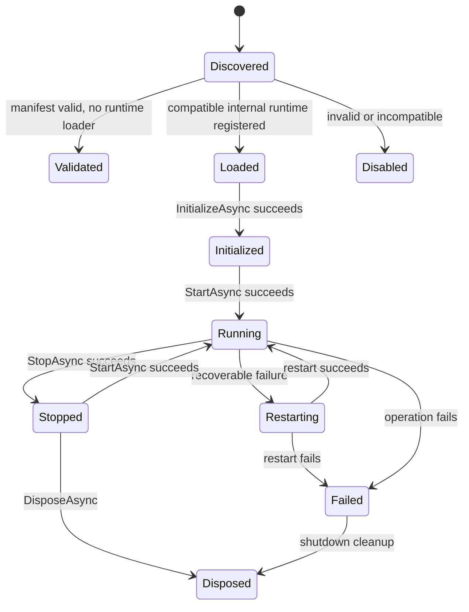

# Plugin Lifecycle

## Catalog And Runtime Flow

## States

`Validated` currently means an external manifest passed compatibility checks but no external code was loaded. It is not equivalent to Running.

## Startup

1. Create logging, paths, and telemetry.
2. Construct internal plugin instances.
3. Read local manifests as data only.
4. Build one catalog using host API `1.0`.
5. Disable invalid, incompatible, shadowed, or dependency-broken candidates.
6. Register compatible runtime instances with their owning subsystem.
7. Initialize and start each plugin independently.
8. Commit lifecycle state to the shared catalog, publish `PluginLifecycleChangedMessage`, and expose runtime health to diagnostics.

Discovery or validation failure never prevents application startup. A failure in one output plugin does not stop another output plugin.

## Recovery And Shutdown

Output Manager updates the same catalog instance registered with diagnostics at Loaded, Initialized, Running, Restarting, Failed, Stopped, and Disposed transitions. The catalog publishes each committed transition through the typed runtime event bus after releasing its state lock. Existing Chapter 13 recovery remains authoritative: cancel that plugin's timers, stop/reset/start it in isolation, and continue healthy plugins.

Shutdown stops plugins in reverse registration order, neutralizes/releases owned output, cancels scheduler work, disposes every instance including rejected registrations, and leaves runtime state out of profiles.

## Future External Loading

A later milestone must add a reviewed loader between Validated and Loaded. It must cover package staging, path containment, dependency assembly resolution, signature policy, API type checks, isolated load contexts, unload behavior, permissions, diagnostics, rollback, and restart requirements. Version 2 intentionally provides no reflection-based shortcut around that work.
