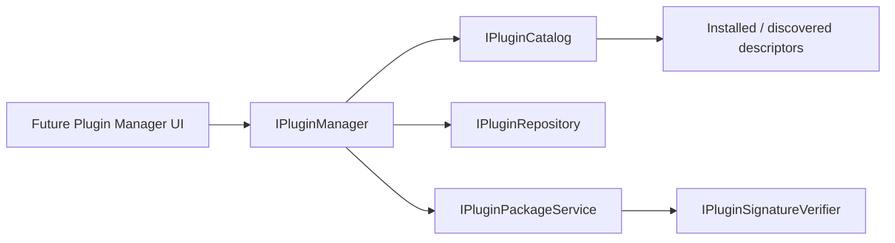

# Plugin Manager Architecture

## Scope

Chapter 15 defines the Plugin Manager service boundaries and catalog model. It does not add an online marketplace, network client, install UI, or external code loader.

## Components

`PluginManagerService` currently supports installed search/filter and compatibility evaluation. Repository and package calls delegate to replaceable interfaces. The production defaults are `OfflinePluginRepository`, `ReadOnlyPluginPackageService`, and `DeferredPluginSignatureVerifier`; they do no network or package mutation.

## Future Repository Data

The repository model already reserves:

- plugin ID, name, author, description, and latest version;
- categories and host API range;
- release notes;
- rating and rating count;
- signature status;
- paged text/category/compatibility search.

Transport, authentication, caching, rate limits, moderation, and rating submission are intentionally unspecified until an online service is approved.

## Future Package Operations

Install, update, and uninstall share `PluginPackageRequest` and `PluginPackageOperationResult`. A future implementation must stage changes atomically, validate the manifest before extraction, contain all paths, verify signatures according to policy, preserve the previous version for rollback, refresh the catalog, and report whether restart is required.

The Plugin Manager must never modify profiles automatically. Removing a plugin may make mappings unhealthy, but profile data remains intact and the Profile Health Report should identify the unavailable target.

## UI Extension Point

A later page can bind only to `IPluginManager` and immutable descriptors. It should expose Installed and Available views, category/text search, compatibility status, release notes, update state, and restart requirements. Online actions remain hidden or disabled while the repository/package services report unavailable.
