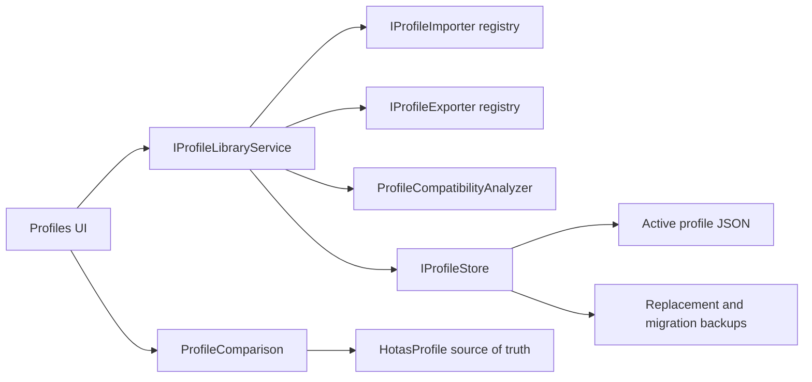

# Profile Library

## Purpose

The Profile Library organizes HOTASBridge profiles and templates without moving mapping behavior into the UI. The WPF page consumes `IProfileLibraryService`; persistence remains owned by `IProfileStore`, and compatibility analysis remains in Core.

## Architecture

No importer, exporter, comparison view, or search result owns a second runtime model. Confirmed imports and selected merges update the same `HotasProfile` configuration used by the Mapping Engine.

## Library Search

The Profiles page filters locally by:

- name;
- game;
- aircraft or vehicle;
- hardware;
- tags;
- author;
- category.

Search is case-insensitive and does not modify profile order or content.

## Package Types

| Kind | Contents | Preferred extension | Legacy extension |
| --- | --- | --- | --- |
| Profile | Complete profile | `.hotasbundle` | `.json` |
| Template | Device-neutral mapping structure and recommended settings | `.hotasbundle` | `.hotastemplate` |
| Selected mappings | Chosen Mapping Explorer rows and required devices/groups | `.hotasbundle` | `.hotasprofile` |
| Device groups | Logical groups and associated devices, without unrelated mappings | `.hotasbundle` | `.hotasprofile` |

The preferred bundle is signed and may carry one bounded screenshot. Legacy JSON stays available for human-readable interchange and backwards compatibility.

Template export replaces stable device identities with deterministic template identities and removes GUID, container, serial, and path evidence. Vendor/product information and user-facing hardware metadata remain available as matching guidance.

## Templates

Built-in templates remain available through `ProfileTemplateCatalog`. Exported template packages use the same profile configuration types but intentionally omit installation-specific device identity. Import preview reports disconnected or unmatched hardware without deleting mappings.

## Comparison

`ProfileComparison` creates a deterministic report covering:

- metadata;
- device groups and selected devices;
- added, removed, or modified mappings;
- transform-chain changes;
- output-assignment changes.

The comparison window shows left and right values side by side. A user may merge selected right-side differences into the active left-side profile. The result is not persisted until the normal Save command runs. Reports export as JSON or standalone HTML and use the same comparison service intended for migration validation.

## Safety

- Import always presents a preview before persistence.
- A user may cancel without changing the profile library.
- Replacing an active profile creates a timestamped `before-import` backup first.
- Unsupported newer schemas are blocked.
- Missing devices and unknown transforms are preserved and reported.
- Existing `.json` import/export remains compatible.
- Signed bundles distinguish trusted, unfamiliar, missing, and invalid signatures.
- Missing or invalid bundle signatures block import; unfamiliar valid publishers require review.
- Package media is bounded and never extracted or executed.
- Converted T.A.R.G.E.T. mappings remain disabled until the user rematches and verifies them.

## Deferred Online Library

Community upload/download, ratings, comments, issue reporting, version history, cloud sync, Steam Workshop, and repository services are intentionally deferred. The importer/exporter registries and package envelope provide extension points without adding network access to Version 2.
