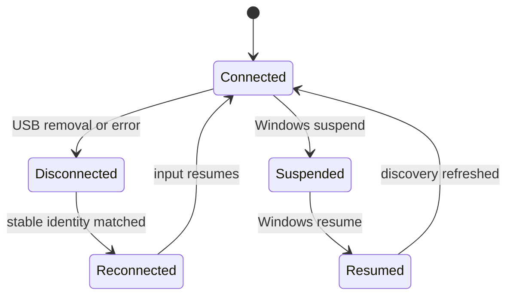

# Recovery

## Emergency Output Reset

Emergency Reset is available from the main window, Output Monitor, system tray, and Debug Developer Dashboard. `RuntimeSessionCoordinator` performs one serialized routine, including after a partial or failed startup:

1. Stops accepting input and cancels the mapping lifetime.
2. Drains Runtime Signal and Output Action queues.
3. Neutralizes and resets every output plugin.
4. Cancels plugin scheduler jobs, including PWM, pulse, and repeat jobs.
5. Clears mapping, held-control, keyboard, Xbox button, and analog runtime state.
6. Disconnects outputs and reports completion through health, telemetry, UI status, and logs.

Every step is isolated and logged so a failure in one plugin does not prevent the remaining cleanup steps.

## Device Recovery

The existing composite provider continues automatic discovery and emits connect, disconnect, reconnect, suspend, resume, and error events. If a selected device becomes unavailable while mapping is active, HOTASBridge neutralizes output and clears mapping state. Reconnect or resume refreshes discovery and recovers the output pipeline without deleting profile mappings.

## Output Recovery

When a plugin throws during action processing, `OutputManager`:

1. Records the error and leaves other plugins running.
2. Cancels timed work owned by the failed plugin.
3. Stops, resets, and restarts that plugin under the lifecycle gate.
4. Clears stale manager errors only after restart succeeds.
5. Publishes `Restarting`, `Running`, or `Error` diagnostics.

Driver-missing and unsupported states remain warnings. Affected outputs are unavailable, while input inspection, profiles, mappings, diagnostics, and other plugins remain usable.

## Safe Mode

Start with `HOTASBridge.App.exe --safe-mode`, or choose Safe Mode after an interrupted-session prompt.

Safe Mode:

- Loads profiles, workspace, selected devices, and diagnostics.
- Does not initialize or start output plugins or the output scheduler.
- Ignores Output Actions and exposes neutral Xbox state.
- Does not restore automatic mapping or any prior runtime output state.
- Keeps Emergency Reset available.

## Session Recovery

`Recovery/session.json` is written before hardware composition and updated after initialization. A coordinated shutdown marks it clean. On an interrupted prior session, the startup prompt offers normal profile/workspace restoration or Safe Mode.

The recovery document stores only application/session state, profile/workspace names, selected device display names, and whether mapping had been active. Runtime outputs, pressed keys, timers, device paths, raw reports, and control history are never restored.

## Windows Power Events

Suspend records whether mapping was active, performs Emergency Reset, and marks power health disabled. Resume refreshes devices and restarts the previous mapping session only after output and input services are rebuilt.

