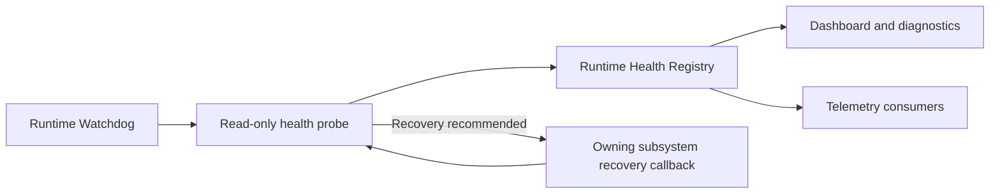

# Reliability

Chapter 13 adds shared health, fault isolation, and recovery contracts without moving mapping or hardware behavior into the monitoring layer.

## Error Classification

| Classification | Meaning | Default response |
| --- | --- | --- |
| Information | Expected lifecycle event | Record diagnostics only |
| Warning | Degraded but usable | Notify health and continue |
| Recoverable Error | A subsystem operation failed | Neutralize affected state and restart that subsystem |
| Critical Error | Runtime safety or multiple operations are affected | Emergency reset, write a report, keep unaffected features available |
| Fatal Error | The process cannot safely continue | Emergency reset where possible, write a report, preserve an unclean session marker |

`RuntimeHealthRegistry` is the UI-independent source for `Running`, `Warning`, `Error`, `Disabled`, and `Restarting` subsystem state. The status bar, telemetry consumers, and future diagnostics exporters read this shared model.

## Fault Boundaries

- Input providers publish errors through their provider boundary; they do not perform mapping recovery.
- Mapping work executes on bounded scheduler lanes. A stopped scheduler can be restarted without moving mapping logic into the watchdog.
- `OutputManager` isolates each plugin. A process failure cancels that plugin's timers and performs `Stop -> Reset -> Start`; other plugins continue.
- WPF dispatcher, unobserved task, and application-domain exceptions are logged and converted into structured crash reports.
- Profile, session, and crash JSON writes use temporary files followed by atomic replacement.

## Runtime Watchdog

The watchdog checks every two seconds:

- Input provider state while mapping is active
- Mapping scheduler state
- Runtime queue pressure
- Output scheduler state and latency
- Output plugin health

Each probe returns diagnostic metadata and an optional recovery recommendation. Recovery is supplied as a callback by the owning subsystem. The watchdog never processes signals, mappings, transforms, or output actions. Recovery attempts have a cooldown and are recorded in health state, logs, and telemetry.

## Health Monitoring

The main status bar summarizes monitored health. Safe Mode reports the Output System as `Disabled`. Recovery transitions are visible as `Restarting`; failed recovery becomes `Error` without stopping unrelated subsystems.

## Verification

- Core tests cover health replacement, recovery-attempt retention, successful watchdog recovery, and isolated probe exceptions.
- Integration tests cover automatic output plugin restart, healthy-plugin continuity, Safe Mode output isolation, recovery-session persistence, damaged-session isolation, and crash-report persistence.

