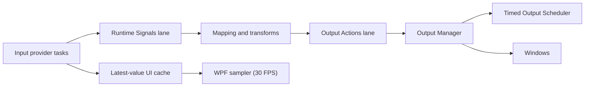
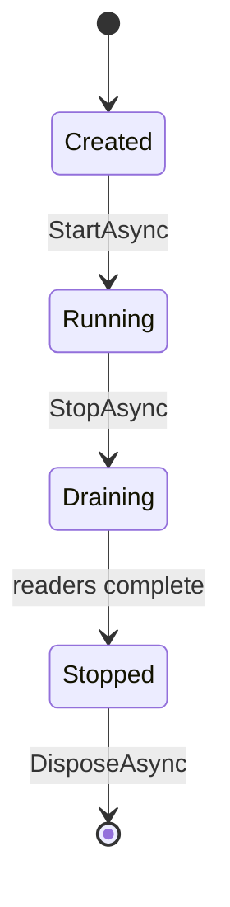

# Runtime Scheduler

## Scope

Chapter 12 adds a central runtime work coordinator without replacing the existing timed output scheduler.

| Capability | Implementation |
| --- | --- |
| Runtime work lanes | `IRuntimeWorkScheduler` and `RuntimeWorkScheduler` |
| Timed output | Existing `IOutputScheduler` and `OutputScheduler` |
| Queue telemetry | Depth, peak, rejected count, average wait, average processing, and health |
| Runtime dispatch | RuntimeSignals are evaluated on the Runtime Signals lane |
| Output dispatch | OutputAction batches are submitted on the Output Actions lane |
| Mapping/output session | `IRuntimeSessionCoordinator` serializes start, stop, cancellation, drain, neutralization, reset, and disconnect |
| Diagnostic writing | `JsonFileLog` owns a bounded asynchronous diagnostic queue |
| UI sampling | Latest control values are coalesced and applied every 33 ms |

## Queue Model

The runtime scheduler creates bounded, single-reader lanes for Input Events, Runtime Signals, Output Actions, Diagnostic Events, and Background Tasks. Current live work uses Runtime Signals and Output Actions. Input acquisition remains provider-owned, logging uses its dedicated queue, and the unused lanes reserve the common lifecycle/telemetry contract for future adapters.

Each lane has capacity 4096 and a warning depth of 1024 by default. A full lane rejects new work, increments a counter, emits a structured warning, and leaves the process running. Accepted work preserves FIFO order within its lane.

## Lifecycle

`DrainAsync` inserts an unmeasured barrier after accepted work. `RuntimeSessionCoordinator` stops signal acceptance, cancels the active session, runs macro/script stop hooks, drains Runtime Signals and Output Actions, neutralizes outputs, clears mapping state, and disconnects plugins under one serialized transition gate. Emergency mode additionally resets every output even when no session is active.

The scheduler cannot restart after shutdown. This prevents a stopped application from silently accepting new runtime work.

## Timed Outputs

`OutputScheduler` remains the only owner of PWM, pulse, repeat, and delayed output timing. It uses one cooperative timer loop with a default 5 ms resolution. It now publishes average/worst scheduler latency and scheduled-job execution duration in addition to current latency and queue depth.

Mapping logic never runs in the timed output scheduler.

## Errors

An exception in one runtime work item is logged and does not terminate its lane. Queue overflow is visible through telemetry and structured logs. Cancellation during shutdown stops remaining callbacks only when graceful draining cannot complete within the caller's cancellation policy.
