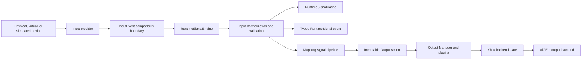
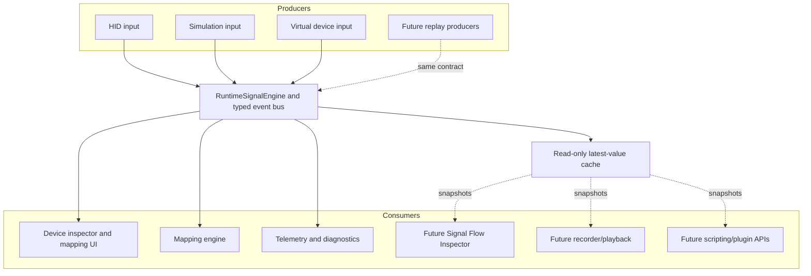

# Runtime Signal Model

This document defines the Chapter 3 runtime signal model and processing engine for HOTASBridge Version 2.

## Requirement Classification

| Requirement | Initial State | Chapter 3 Result |
| --- | --- | --- |
| Common RuntimeSignal model | Partial | Expanded with explicit raw, normalized, current, previous, state, type, quality, metadata, flags, diagnostics, and history fields. |
| Minimum signal types | Partial | Analog, digital, relative, absolute, directional, stateful, and virtual types are defined without changing consumer interfaces. |
| Immutable publication | Missing | The runtime engine freezes metadata/history before publication; consumers receive read-only signal snapshots. |
| Every input becomes a RuntimeSignal | Partial | `MainViewModel` publishes every input through `IRuntimeSignalEngine` before UI, learning, diagnostics, or mapping consumption. |
| Standard processing pipeline | Partial | Added ordered, insertable `IRuntimeSignalStage` and `IRuntimeSignalPipeline` contracts. |
| Runtime state separate from configuration | Partial | Toggle, pulse, current/previous values, timestamps, and future PWM/repeat fields now live in `RuntimeMappingStateStore`. |
| Internal event publication | Missing | Added signal publication plus shared typed runtime events with ordered delivery, disposable subscriptions, counters, and subscriber-failure isolation. |
| Runtime Signal Cache, Agent Note 004 | Missing | Added engine-owned latest-value cache with read-only consumer access. |
| Invalid signal recovery | Partial | Non-finite values and stage failures are flagged, diagnosed, logged when logging is available, and do not terminate publication. |
| Signal-native output boundary | Complete | Mapping stages remain RuntimeSignal-native and the Mapping Engine emits standardized immutable OutputActions consumed by output plugins; XboxState is backend state only. |

## RuntimeSignal Contract

| Field | Purpose |
| --- | --- |
| SignalId | Unique identity retained through every processing stage. |
| Source | Stable device/control IDs, display names, and input control type. |
| Kind | Analog, digital, relative, absolute, directional, stateful, virtual, or future-compatible type. |
| RawValue | Producer value before normalization. |
| NormalizedValue | Standardized producer value used as the mapping pipeline input. |
| CurrentValue | Value at the current pipeline stage. |
| PreviousValue | Previous published/control or mapping-stage value. |
| Timestamp | Source event timestamp retained through processing. |
| CurrentState | Unknown, inactive, active, changing, or invalid. |
| Metadata | Read-only optional names, qualifiers, source details, tags, and output target information. |
| Flags | Enabled, processed, synthetic, warning/error, and pipeline-control state. |
| Quality | Valid, estimated, clamped, smoothed, filtered, simulated, replayed, or invalid. |
| Diagnostics | Warning/error severity and human-readable details. |
| History | Optional read-only samples; empty in the hot path by default. |

`RuntimeSignal`, `RuntimeSignalSource`, `RuntimeSignalValue`, and diagnostics are records with init-only values. Before publication, the engine copies metadata into a read-only dictionary and history into a read-only collection. Pipeline stages produce a new signal or return the unchanged signal; they never mutate a published instance.

## Signal Lifecycle

The `InputEvent` object remains an acquisition DTO inside input-provider adapters. It is converted once by `RuntimeSignalEngine`; UI, diagnostics, recording/playback, scripting, and mapping code use the resulting immutable signal. The test-only Mapping Engine event/state adapters have been retired.

## Processing Pipeline

```mermaid
flowchart LR
    Input["RuntimeSignal input"]
    Normalization["Normalization"]
    Calibration["Calibration"]
    Deadzone["Deadzone"]
    Filtering["Filtering"]
    Curve["Response curve"]
    Scaling["Scaling"]
    Transform["Transform"]
    OutputMapping["Output mapping"]
    OutputSignal["Virtual RuntimeSignal"]
    Action["OutputAction"]
    Plugin["Output Manager/plugin boundary"]

    Input --> Normalization
    Normalization --> Calibration
    Calibration --> Deadzone
    Deadzone --> Filtering
    Filtering --> Curve
    Curve --> Scaling
    Scaling --> Transform
    Transform --> OutputMapping
    OutputMapping --> OutputSignal
    OutputSignal --> Action
    Action --> Plugin
```

The stage order is deterministic and represented by an ordered `IRuntimeSignalStage` collection. New stages can be inserted by composition without changing the pipeline or consumer interfaces.

Current stage behavior:

- Input normalization validates finite values and clamps analog/digital values where required.
- Mapping normalization converts configured axis ranges.
- Calibration applies center offset and hardware inversion.
- Deadzone applies inner and anti-deadzone behavior.
- Filtering is an insertable disabled stage until filter configuration is introduced.
- Response curve uses the existing linear, exponential, S-curve, or control-point processor.
- Scaling applies saturation, sensitivity, output limits, and bipolar/unipolar conversion.
- Transform applies mapping inversion and button inversion.
- Output mapping applies direct, toggle, pulse, release, and encoder behavior and emits a virtual signal tagged with output target/control metadata.

## Producers And Consumers

Producers do not map signals. Consumers receive immutable publications and do not know which hardware API produced them. `RuntimeSignalPublishedMessage` is emitted only after the authoritative cache has been updated, allowing a subscriber to reconcile current state safely. See `docs/EVENT_BUS.md`.

## Cache And Runtime State

`IRuntimeSignalCache` exposes the active-control count, lookup by source device/control IDs, and a read-only ordered snapshot. `RuntimeSignalCache.Store` is internal and called only by `RuntimeSignalEngine`. It keeps one latest immutable signal per active control, so memory scales with active controls rather than event count. Optional history stays empty on the hot path.

`IRuntimeMappingStateStore` exposes read-only state separately from profile configuration. It tracks current/previous values, last change/output timestamps, active behavior, toggle state, pulse expiration, and reserved PWM/repeat timer state. Runtime state is not serialized into profile JSON.

## Error And Performance Rules

- Non-finite normalized values are marked invalid and replaced with a safe processing value.
- Invalid signals are cached and published for diagnostics but ignored by mapping.
- Stage exceptions become signal diagnostics and error flags; later stages continue where safe.
- One failing legacy or typed-bus publication subscriber cannot stop later subscribers or the signal engine.
- The hot cache retains only latest values and uses concurrent lookups.
- Disabled stages return the existing signal without allocating a replacement.
- Pipeline order is fixed for a processing call and contains no blocking operations.
- Telemetry records publication and per-stage latency independently from the UI.

## Compatibility And Deferred Work

Xbox output remains profile-compatible. Output Mapping produces a virtual RuntimeSignal, `MappingEngine` converts it into immutable `OutputAction` records, and `OutputManager` routes actions to ViGEm Xbox or Windows SendInput keyboard plugins. Dynamic external plugin discovery remains deferred.

Input publication occurs on the provider callback and remains allocation-light. Mapping and output work is handed to the existing runtime scheduler/coordinator; event-bus handlers must not perform blocking work on the publisher thread.
