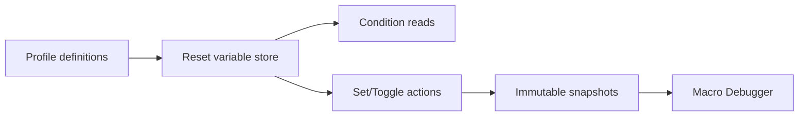

# Runtime Variables

## Model

Runtime variables provide shared session state for macro conditions and actions. Version 1 supports Boolean, Integer, and Float values. String, array, dictionary, and persisted scopes are deferred.

Each profile stores only definitions:

- name;
- type;
- initial value;
- description.

The current value and last-update timestamp belong to `IRuntimeVariableStore` and are never written into profile JSON.

## Lifecycle

The store resets from definitions when the active profile is configured. This occurs during initial load, profile replacement, and mapping start. Restarting HOTASBridge or changing profiles does not restore prior runtime values.

## Contract

`IRuntimeVariableStore` exposes typed lookup, string or typed assignment, Boolean toggle, reset, and immutable snapshots. The implementation is thread-safe and uses invariant-culture parsing.

Boolean values accept `true` or `false`. Integer values use signed 64-bit invariant integers. Float values must be finite invariant numbers.

## Conditions

Variable conditions identify a variable by case-insensitive name, provide a comparison operator and expected value, and may invert the final result through `ExpectedState`.

Supported comparisons are Equal, Not Equal, Greater Than, Greater Than Or Equal, Less Than, and Less Than Or Equal. Boolean values compare as zero or one.

## Actions

`SetVariable` parses a value using the declared type. `ToggleVariable` applies only to Boolean variables. Invalid assignments fail the current macro, publish diagnostics, and release that macro's active outputs.

## Scope And Safety

Variables are profile-session scoped. They are not global application settings and cannot access devices, files, processes, or plugins. Snapshot consumers cannot mutate the store.

Future persistent variables require a separate versioned storage policy, explicit opt-in, migration, and privacy review. They must not reuse runtime profile state implicitly.
