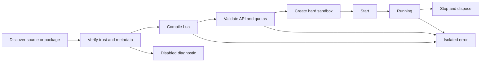

# Scripting Engine

## Status

Chapter 20 provides an optional Lua scripting foundation. TD-033 hardens that foundation for trusted local automation. The Script Engine remains Experimental, disabled by default, and disabled in Safe Mode. HOTASBridge remains fully functional when scripting is unavailable.

Scripts live under `%LOCALAPPDATA%\HOTASBridge\Scripts`; they are not embedded in profiles and do not change profile schema v9.

| Capability | Status |
| --- | --- |
| Lua lifecycle and stable Script API | Complete foundation |
| RuntimeSignal, profile, device, mapping, macro, and timer events | Complete foundation |
| OutputAction, variable, profile, mapping, notification, log, and scheduler adapters | Complete foundation |
| Hard sandbox and centralized cooperative execution | Complete |
| Explicit permissions and bounded source/event/command/instruction/string/allocation resources | Complete |
| Deterministic signed `.hotasscript` packages and local publisher trust store | Complete trusted-package foundation |
| Script Workbench source validation, local editing, atomic save, reload, and diagnostics | Complete Experimental surface |
| Untrusted package execution | Blocked until an out-of-process engine provider exists |
| Breakpoints, step debugging, persistent variables, and alternate languages | Deferred |

## Discovery

`LuaScriptCatalog` discovers top-level `.lua` and `.hotasscript` files. It does not recurse, extract packages, load assemblies, or contact online services. Duplicate IDs are all disabled rather than allowing one source to shadow another.

Loose local scripts may declare metadata in the first 40 lines:

```lua
-- hotas:id=example-throttle
-- hotas:name=Example Throttle
-- hotas:version=1.0.0
-- hotas:api=1.0
-- hotas:enabled=true
-- hotas:permissions=ReadSignals,ReadVariables,WriteVariables,Log
-- hotas:max_pending_events=128
-- hotas:max_instructions=100000
-- hotas:allocation_quota_bytes=4194304
```

Permission metadata is optional only for loose local scripts, which retain the previous full-access compatibility default and report a warning. Script packages must declare permissions explicitly. See `docs/SCRIPT_PACKAGES.md`.

## Lifecycle



Application startup loads scripts after output services are available. Execution starts with mapping runtime activation and stops before output reset. Shutdown cancels script timers and clears script-owned local/session state.

## Event Handlers

Scripts may define these optional handlers:

```lua
function on_start() end
function on_stop() end
function on_signal(event) end
function on_profile_loaded(event) end
function on_profile_changed(event) end
function on_device_connected(event) end
function on_device_disconnected(event) end
function on_mapping_activated(event) end
function on_macro_triggered(event) end
function on_timer(event) end
```

Runtime publishers enqueue immutable, script-independent event data. Lua execution occurs on the centralized scheduler, never on the input or UI thread.

## Runtime Behavior

- Permission checks occur at every host API operation.
- Each invocation runs in bounded instruction slices and has allocation and host-command quotas.
- Each script has a bounded pending-event queue; overflow disables only that script.
- Side effects are buffered and committed only after a handler completes successfully.
- Output requests use the OutputAction queue and Output Manager.
- Persistent variable scope remains rejected until consent, storage versioning, and quotas are designed.
- Diagnostics expose lifecycle, trust, signature, permissions, isolation, timing, pending/rejected events, total allocation, peak invocation allocation, and errors.

## Script Workbench

Enable Experimental features and the `script-engine` flag, restart, switch to Advanced mode, and open **Script Workbench**. The page can:

- create a permission-declared local Lua template;
- edit loose `.lua` files located directly in the Scripts directory;
- validate metadata and Lua syntax;
- save atomically only after validation;
- reload the catalog and active script runtime;
- inspect package trust, signature, isolation, permissions, quota pressure, state, and errors.

Signed packages and invalid/untrusted package records are read-only in the Workbench.

## Example

```lua
-- hotas:id=gear-warning
-- hotas:name=Gear Warning
-- hotas:api=1.0
-- hotas:permissions=WriteVariables,Notify

function on_signal(event)
    if event.signal.control_id == "gear" and event.signal.value > 0.5 then
        hotas.notify("Gear signal is active")
        hotas.set_variable("gear_active", true, "session")
    end
end
```

See `docs/SCRIPT_API.md`, `docs/SCRIPT_SECURITY.md`, and `docs/SCRIPT_PACKAGES.md`.
