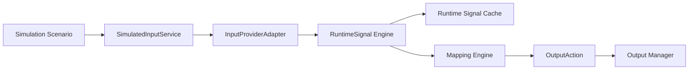

# Simulation, Recording, and Playback

## Provider Architecture

`SimulatedInputService` implements the same `IInputDeviceCatalog` and `IInputEventSource` contracts as Windows input providers. Its `InputEvent`s pass through `InputProviderAdapter`, become immutable `RuntimeSignal`s, enter the shared cache and Mapping Engine, and reach Output Manager plugins through normal `OutputAction`s.

Simulation never bypasses mapping, transforms, telemetry, or output isolation.

## Built-In Scenarios

| ID | Scenario | Devices |
| --- | --- | --- |
| `generic-hotas` | Generic HOTAS | Stick, dual throttle, pedals, high-control-count virtual device |
| `twin-engine-aircraft` | Twin Engine Aircraft | Yoke, two-engine quadrant, pedals |
| `helicopter` | Helicopter | Cyclic, collective, anti-torque pedals |
| `racing-wheel` | Racing Wheel | Wheel, pedals, shifter/switch controls |
| `gamepad` | Gamepad | Two sticks, triggers, D-pad, buttons |

The default app behavior remains Generic HOTAS so existing demo-device workflows are preserved.

## Input Modes

- `Mixed`: deterministic sine-wave axes plus seeded button, hat, and encoder activity.
- `Random`: seeded random analog values plus discrete activity; the seed is configurable for repeatability.
- `Scripted`: ordered scenario steps with explicit offsets, device/control identity, raw value, normalized value, and optional qualifier.

`PlayScriptOnceAsync` runs a scenario exactly once for integration tests. Normal scripted provider operation repeats the sequence until stopped.

## Recording Format

RuntimeSignal recordings are JSON documents stored under `%LOCALAPPDATA%\HOTASBridge\Diagnostics\SignalRecordings`.

Top-level fields:

- `schemaVersion`
- `recordingId`
- `name`
- `applicationVersion`
- `createdUtc`
- `duration`
- `metadata`
- `entries`

Each entry stores:

- monotonic offset from recording start;
- original signal ID;
- signal kind and state;
- raw, normalized, current, and previous values;
- source device/control identity;
- metadata, flags, and quality.

Diagnostics history is intentionally not duplicated into every entry. This keeps recordings lightweight while retaining everything needed to reproduce mapping behavior.

Writes are atomic through a temporary file. A damaged recording is isolated while valid recordings remain available. Newer unsupported recording schemas are rejected without modification.

## Playback

Playback can honor recorded timing at a configurable speed or publish immediately for deterministic tests. Entries are ordered by monotonic offset. Playback rebases timestamps to the current session, creates a new signal ID, retains the original ID in metadata, and marks signals as replayed and synthetic.

In the Debug Test Runner, playback uses the same MainViewModel signal handler as live input. Live diagnostics always update; when mapping is running, replay also drives the Mapping Engine and output plugins.

The recorder ignores replayed signals to prevent recursive recordings.

## Regression Comparison

`OutputActionRegressionComparer` compares expected and actual action sequences by:

- count and order;
- mapping ID;
- plugin and control ID;
- action type;
- active contribution state;
- numeric value with a configurable tolerance.

Action timestamps are ignored because playback rebases time by design.

## Safety

- Playback never restores runtime output state from disk.
- Stopping mapping or Emergency Reset still releases outputs.
- Invalid recording files cannot stop discovery or live input.
- Simulated controls use `DeviceSourceKind.Simulated` and remain distinguishable in diagnostics.
