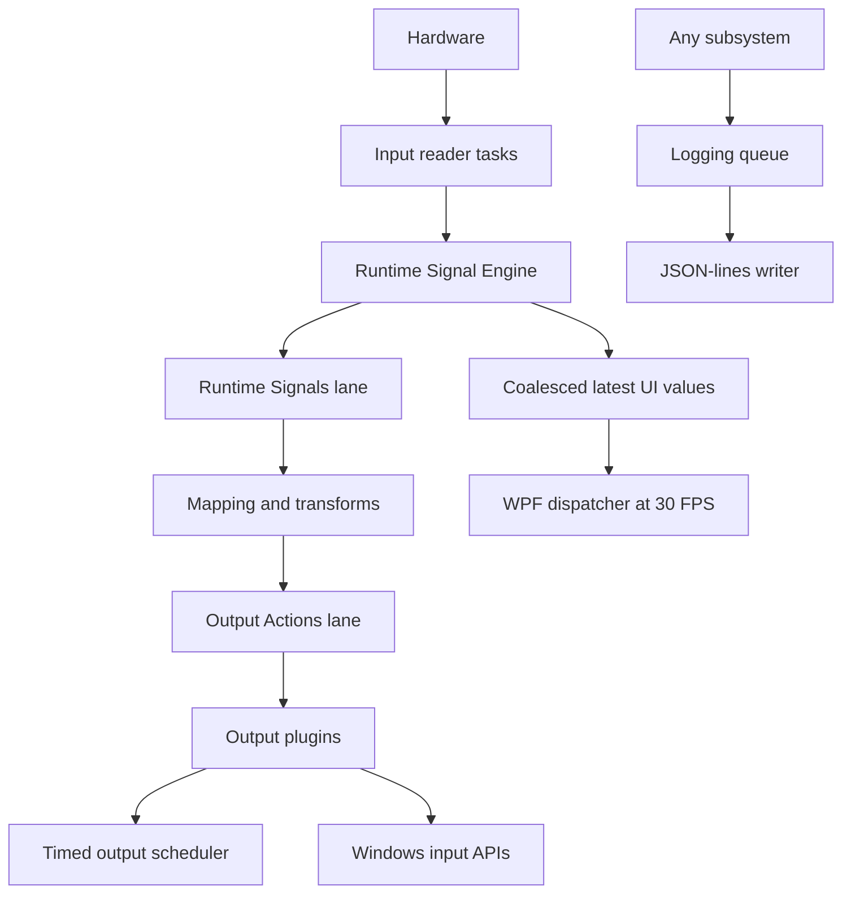

# Threading

## Execution Paths

| Path | Ownership |
| --- | --- |
| UI thread | Rendering, commands, observable collections, view-model notifications |
| Input tasks | Windows HID/simulation reads and RuntimeSignal publication |
| Runtime session lifecycle | `RuntimeSessionCoordinator`: serialized start/stop, cancellation ownership, extension hooks, drain, neutralize, reset, and disconnect |
| Runtime Signals lane | `RuntimeMappingCoordinator`: held-control state, active-layer context, mapping lookup, conditions, transforms, OutputAction creation |
| Output Actions lane | Ordered Output Manager submission and plugin dispatch |
| Timed output loop | PWM, pulse, repeat, and delayed callbacks |
| Logging writer | Batched asynchronous JSON-lines file writes |
| Background tasks | Profile/configuration file I/O and device discovery operations |

Execution paths are logical asynchronous lanes; the runtime does not require permanent processor-affined threads. This allows the .NET thread pool to scale while preserving single-reader ordering where runtime state requires it.

Logging producers never perform file I/O. They serialize into a bounded multi-writer/single-reader channel. The writer drains up to 128 commands per batch, waits at most 100 ms to coalesce low-volume bursts, and treats flush/retention commands as ordered barriers. Shutdown completes the channel, writes remaining batches, flushes the stream, and only then disposes the writer.

## Thread Safety Rules

- Published RuntimeSignals and OutputActions are immutable.
- Runtime mapping context and held-control snapshots are copied under the coordinator's private state lock.
- Mapping snapshots use volatile publication.
- Mapping evaluation and live mapping rebuilds share one execution lock so transform/runtime state cannot be reset during evaluation.
- Each scheduler lane has one reader and supports multiple producers.
- Output plugins retain their existing internal synchronization and failure isolation.
- WPF collections are touched only by the dispatcher sampler.
- Telemetry snapshots copy under a short lock and are read-only to consumers.
- Structured logging never performs file I/O on runtime or UI callers.

## UI Throttling

Input publication stores only the newest RuntimeSignal for each device/control in the pending UI dictionary. A 33 ms dispatcher timer removes the latest values and updates visual controls, event text, learning state, Xbox visualization, and rates. Runtime mapping still receives every accepted signal and is not throttled by the UI rate.

## Shutdown Order

1. Stop Auto Save and UI sampling.
2. Ask the runtime session coordinator to stop signal acceptance and cancel the mapping lifetime.
3. Stop macro/script session hooks.
4. Drain Runtime Signals, then Output Actions.
5. Neutralize outputs, clear mapping state, and disconnect plugins.
6. Stop diagnostics views and Debug profiler sampling.
7. Dispose input providers.
8. Stop runtime work lanes.
9. Reset, stop, and dispose output plugins and timed scheduler.
10. Write and flush `ApplicationShutdown`, then stop the logging writer.

Before each awaited shutdown boundary, the shell records `ApplicationShutdownStepStarted` with a stable step name and records `ApplicationShutdownCompleted` after output disposal. These events make a forced-termination or smoke timeout diagnosable without changing shutdown ordering.

The invariant is no active input reader, queued runtime work, timed output, held key/button, virtual controller connection, or unflushed accepted log event after shutdown completes.
