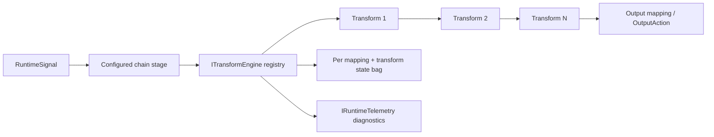
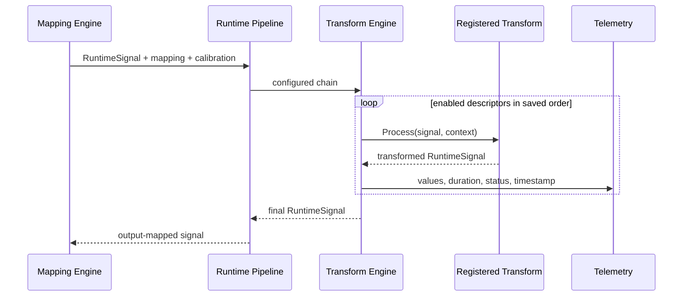

# Transform Engine

## Requirement Comparison

| Requirement | Result |
| --- | --- |
| Modular, reusable, testable transforms | Complete. `IRuntimeTransform` implementations are registered through `ITransformEngine`. |
| RuntimeSignal-only processing | Complete. Every transform receives and returns an immutable-style `RuntimeSignal` value. |
| Ordered per-mapping chains | Complete. `ProfileTransformConfiguration` entries execute in stored order. |
| Live editing | Complete. `UpdateMapping` resets only the edited mapping's transform state and publishes output transitions. |
| Transform diagnostics | Complete. Every executed or disabled descriptor publishes values, duration, state, warning/error, and timestamp. |
| Configurable filtering | Complete. Moving Average, Exponential Smoothing, and Median Filter share validated typed configuration and isolated per-mapping runtime state. |
| Device calibration | Complete foundation. Profiles store minimum, center, maximum, and offset per device/control. |
| Circular/radial paired axes | Partial. True radial math uses `pairedAxisValue` metadata when a producer supplies it; scalar fallback remains valid. |
| Analog PWM restriction | Complete. Profile and runtime validation reject PWM on non-axis mappings. |
| Transform presets | Complete. Versioned, device-independent JSON presets support CRUD, import, and export. |
| Keyboard/PWM OS injection | Complete through the Keyboard output plugin; the Transform Engine still emits only standardized actions and metadata. |

## Architecture

The mapping pipeline owns one `RuntimeTransformEngine`. The engine resolves descriptors by case-insensitive type, executes only enabled transforms, isolates state by mapping ID and transform ID, catches transform exceptions, and continues with a diagnostic error signal rather than terminating input processing.

## Interfaces

- `ITransformEngine` exposes registered descriptors, chain execution, per-mapping reset, and global reset.
- `IRuntimeTransform` exposes metadata and one deterministic `Process` operation.
- `TransformExecutionContext` supplies mapping configuration, the current descriptor, optional device calibration, and an isolated `TransformStateBag`.
- `ConfiguredTransformChainSignalStage` adapts the existing runtime pipeline to the registry.

New transforms are added by implementing `IRuntimeTransform` and registering the instance during engine composition. Existing transforms and interfaces do not require modification.

## Lifecycle

## Live Editing

The Transform Editor modifies the active mapping chain and calls `IMappingEngine.UpdateMapping`. The operation:

1. Clears only that mapping's stateful filter/toggle/pulse/direction data.
2. Rebuilds the atomic mapping snapshot.
3. Emits release or transfer actions if an active output changed.
4. Leaves all unrelated mappings and their runtime state active.

Filter descriptors use a focused editor instead of the generic settings table. The algorithm selector exposes Moving Average, Exponential Smoothing, and Median Filter. Exponential `alpha` is constrained to `(0, 1]`; Moving Average and Median `window` values are constrained to `2-101`. Applying a filter rebuilds only the selected mapping and resets its filter history.

## Performance

- Mapping lookup remains indexed by device/control.
- Transform state uses concurrent dictionaries and is allocated only for executed descriptors.
- Disabled descriptors do not execute.
- Runtime signals are replaced with record copies; profile configuration is not copied per event.
- Diagnostics use the shared telemetry service and replace stage snapshots by stable IDs.

No blind performance claim is made. Current focused tests assert deterministic behavior; future load profiling should measure high mapping counts and filter window sizes.

## Error Handling

Unregistered descriptors are preserved and reported as warnings. Unsupported analog-only transforms are skipped with warnings. Transform exceptions set error diagnostics on the signal and are contained by the runtime pipeline. Invalid profile combinations, including digital analog-PWM mappings and enabled filters with invalid mode, alpha, window, or input type, are disabled by mapping validation. Runtime filter resolution still applies safe defaults and bounds defensively when consuming legacy data.

## Deferred

- Double-press toggle mode.
- Recorder-backed single-step transform replay.
- Native paired-axis grouping when producers do not publish paired-axis metadata.
