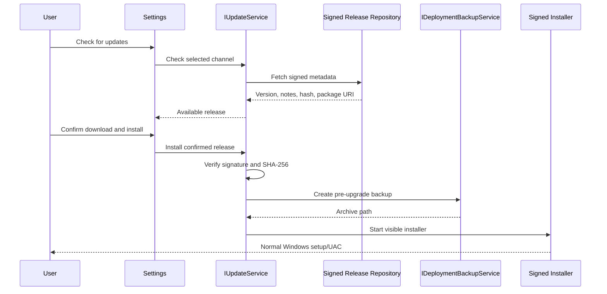

# Update System

## Current State

HOTASBridge 0.22 supports manual upgrades through the signed Inno installer. Online checks, background downloads, and automatic installation are not active.

`IUpdateService` and update policy models are present so a later service can be added without coupling Settings or deployment code to a network client. The registered `OfflineUpdateService` returns a clear unavailable result and performs no network work.

## Channels

Application settings schema v3 stores one selected channel:

| Channel | Intended use |
| --- | --- |
| Stable | Signed supported releases |
| Beta | Explicit preview participation |

Development builds remain a build-time channel and are not offered by the end-user update selector.

## Safety Policy

Every future update must satisfy all of the following:

1. The user initiates or confirms installation.
2. The package is signed by a trusted HOTASBridge publisher identity.
3. The package hash matches trusted release metadata.
4. Version and channel are compatible with the current installation.
5. A deployment backup completes before application files change.
6. Output is neutralized and HOTASBridge is closed before setup begins.
7. Inno rollback and the deployment archive remain available.

`UpdatePolicy` currently enforces explicit confirmation and signed-package status at the UI-independent boundary. An implementation must add signature-chain, hash, downgrade, and package-source verification before enabling installation.

## Future Flow

No update operation may install a kernel driver. ViGEmBus remains a separate, explicit First Run Setup action.

## Settings Persistence

The following fields are stored separately from profiles:

- `updateChannel`;
- `lastUpdateCheckUtc`;
- first-run completion/skip state and completed application version.

Mappings, profile metadata, output state, and runtime state are not update settings.

## Offline Behavior

When no update provider is configured:

- **Check for updates** reports that online updates are unavailable;
- no HTTP request is attempted;
- no package is downloaded or staged;
- users upgrade with a signed installer;
- current profiles/settings/workspaces remain untouched.

## Downgrade

Downgrade is not a supported automatic action. A developer or support engineer may restore a pre-upgrade deployment archive after closing HOTASBridge. Profiles with schemas newer than the target application remain protected from downgrade by existing profile validation.

## Deferred Work

Before enabling online updates:

- select a repository protocol and trust root;
- implement metadata and package signature verification;
- implement resumable staging outside the application directory;
- add proxy/offline/error handling;
- add stable/beta release-note presentation;
- add clean-VM update and rollback automation;
- add privacy and telemetry disclosure;
- complete security review.
